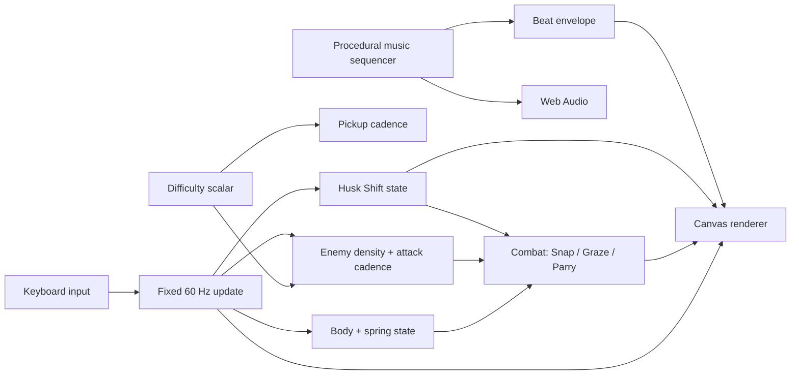

<div align="center">

<a href="docs/stretchicorn-hero.png"></a>

# 🌽🦄 STRETCHICORN

### **STRETCH · SNAP · SHUCK.**

**A tiny desktop action game where you play as an enchanted unicorn gifted the power to rainbow-stretch and fight off an army of angry corn across 13 chaotic trials!**

Built for **js13kGames 2026 · Unicorns & Rainbows**.

[**Download the current v0.21.0 competition ZIP**](dist/stretchicorn-desktop-v0.21.0.zip)

**13 hearts · 13 trials · 4 difficulty modes · way too much corn**

</div>

---

## What is Stretchicorn?

Stretchicorn is a fast arcade-action game built around one strange control idea: **the unicorn is controlled from both ends**.

You move the vulnerable body with one hand, steer the safe head and horn with the other, then pull the two apart to charge the rainbow stretched between them.

```text
PULL ←     ♥ BODY ═══════ 🌈 RAINBOW ═══════ 🦄 HEAD / HORN     → AIM
           vulnerable         safe                 safe
```

Only the **♥ body** takes damage. The head and rainbow can safely reach into danger to attack, collect power-ups, parry kernels and prepare the next launch.

When the unicorn lights up, press **Space** and turn that tension into a **Rainbow Snap**.

The result is part action game, part elastic slingshot, part bullet-dodging geometry puzzle, and part argument with a deeply unreasonable amount of corn.

---

## The game in 30 seconds

1. **Choose a difficulty.** Press `1` Easy, `2` Normal, `3` Hard, or `4` Impossible. Space / Enter starts Normal.
2. **Move the ♥ body with WASD.** This is the part enemies can hurt.
3. **Aim the head with the Arrow Keys.** The horn rotates smoothly through continuous angles.
4. **Pull the body away from the horn.** That loads the rainbow spring.
5. **Watch the unicorn light up.** Glow + boing means Rainbow Snap is ready.
6. **Press Space.** Launch through enemies, projectiles and pickups.
7. **Turn, recharge and chain another Snap.** Good routes become Double Rainbows, Parries, Grazes and score.

The strongest plays make one movement solve several problems at once: dodge a projectile, hit a cob, sweep through a power-up and set up the next attack before the rainbow finishes recoiling.

---

# 🌈 Four difficulty modes

Stretchicorn now supports four complete campaign modes. Difficulty changes **pressure and resource economy**, not the feel of the unicorn.

| Mode | Launch key | Enemy density | Attack pressure | Friendly pickups | Intended feel |
|---|---:|---:|---:|---:|---|
| **Easy** | `1` | ~0.7× | ~0.7× | more frequent | learn the two-handed controls |
| **Normal** | `2` | 1.0× | 1.0× | original cadence | the original balanced campaign |
| **Hard** | `3` | ~1.3× | ~1.3× | less frequent | denser routing and faster decisions |
| **Impossible** | `4` | ~1.6× | ~1.6× | substantially scarcer | maximum corn pressure |

**Normal is the exact gameplay baseline.** Player movement speed, spring physics, damage rules, enemy movement speed and telegraph durations remain unchanged across modes. Harder modes increase how many threats you must solve and how often attacks arrive, without making warnings unfairly shorter.

Difficulty also scales boss reinforcement ceilings so late fights continue escalating instead of hitting the Normal population cap too early.

A few representative starting populations:

| Trial | Easy | Normal | Hard | Impossible |
|---|---:|---:|---:|---:|
| 1 · Pastel Patch | 3 | 5 | 6 | 8 |
| 5 · Maize Monarch | 3 | 4 | 5 | 6 |
| 9 · Husk Architect | 1 | 1 | 1 | **2 Architects** |
| 11 · Kernel Gauntlet | 14 | 21 | 28 | **34** |
| 13 · Cobtopus | 8 | 11 | 14 | **16** |

If you die and retry, the selected difficulty is preserved. Returning to the title screen is how you pick a new mode.

See [`docs/difficulty-modes.md`](docs/difficulty-modes.md) for the complete 52-stage/mode population matrix and scaling rules.

---

# 🎮 Controls

<div align="center">


</div>

| Input | Action |
|---|---|
| **1 / 2 / 3 / 4** | Start Easy / Normal / Hard / Impossible from title |
| **Space / Enter** | Start Normal from title |
| **W A S D** | Move the vulnerable ♥ body |
| **Arrow Keys** | Smoothly steer the safe head / horn |
| **Space** | Horn strike / Rainbow Snap |
| **P** | Pause / resume |
| **M** | Return to menu |
| **C** | Controls page |
| **R** | Rules page |
| **S** | Settings page |

### Custom controls

The Controls page supports persistent rebinding for all nine gameplay actions.

```text
↑ / ↓         select action
ENTER         begin rebinding
press a key   assign it
D             restore defaults
M / ESC       back
```

Duplicate assignments swap rather than coexist. `M` and `P` remain reserved for menu/pause so a custom binding cannot accidentally break those global controls. Bindings persist through `localStorage`.

### Audio settings

Music and gameplay sounds are independently adjustable and persistent:

```text
Music        OFF / 25 / 50 / 75 / 100%
Game Sounds  OFF / 25 / 50 / 75 / 100%
```

---

# 🌈 Core mechanics

## Rainbow Spring

The player is represented by two important points:

```text
A = vulnerable ♥ body
P = safe head / horn
```

The head is reconstructed from body position, aim direction and one scalar spring length:

```text
P = A + aimVector × springLength
```

This keeps the character elastic **without sacrificing aiming precision**. Arrow input owns the angle, the spring owns the distance, and WASD movement loads the spring.

### Pull to charge

Spring charge comes from movement opposite the horn direction:

```text
charge contribution = dot(movementDirection, -aimDirection)
```

Pull straight backward and charge quickly. Move sideways and the contribution falls. Move toward the horn and the spring does not load.

A rear arrow shows the correct pull direction directly in the arena.

### Snap-ready feedback

When the threshold is reached, the whole unicorn glows, the rainbow brightens, particles appear and a procedural **boing** sounds. The character itself becomes the readiness meter so the player does not need to stare at a HUD while dodging kernels.

## Rainbow Snap

A charged Space attack combines several jobs into one verb:

- horn attack,
- dash,
- traversal,
- evasive movement,
- brief safety window,
- pickup routing,
- combo setup.

## Double Rainbow

Recharge and Snap again during the short follow-up window for extra reach, damage, particles and safety.

## Popcorn Graze

Skim a hostile kernel without touching the ♥ body to gain **+13 score and spring energy**.

```text
far      → safe
near     → GRAZE +13 + spring
contact  → damage
```

## Kernel Parry

Hit an incoming kernel with the horn to reflect it back into the corn army. Reflected kernels damage enemies, restore spring energy and briefly create breathing room.

## Lucky 13

Every 13 defeated enemies triggers a Lucky 13 burst with health, shield, spring energy, score and rainbow spectacle.

---

# 🌽 The corn army

The campaign mixes a compact roster of enemies with different tactical roles rather than simply scaling health upward.

| Enemy | What it asks from you |
|---|---|
| **Kernel Kamikaze** | Keep moving and protect the ♥ body |
| **Cob Charger** | Read the telegraph and redirect the charge |
| **Pop-Gunner** | Graze, Parry or route around ranged pressure |
| **Prism Popper** | Handle curved multi-shot patterns |
| **Husk Bruiser** | Commit to damage against armor |
| **Husk Ram** | Use geometry and punish recovery |
| **Maize Monarch** | Adapt through a four-phase mid-game boss |
| **Husk Architect** | Read dynamic terrain while fighting |
| **Cobtopus** | Combine everything in the final trial |

---

# 🌽 Power-ups

Power-ups are tiny magical cobs that can be collected by the body **or anywhere along the stretched rainbow**.

| Pickup | Effect |
|---|---|
| **♥ Heart Kernel** | Restore one heart |
| **Husk Shield** | Absorb the next hit |
| **Butter Boost** | Temporary movement speed |
| **Prism Cob** | Easier spring charging |
| **Gold Cob** | Temporary 2× score |

Rainbow Snap temporarily increases collection reach, so efficient routes can attack and collect at the same time. Difficulty changes **how often** friendly pickups arrive, not what they do.

---

# 🧱 Husk Shift: dynamic arena geometry

Later trials introduce blocks that **warn, materialize, harden, protect, disappear and return somewhere else**.

```text
WARNING / MATERIALIZING   2.0 s
          ↓
SOLID COVER               2.35 s
          ↓
OPEN ARENA
          ↓
new layout + repeat
```

One warning footprint freezes around the current ♥ body location. It does not chase the player. It gives two seconds to react.

If the body is still inside when the block hardens, the player loses a life and is knocked out of the new geometry. Once solid, that same block becomes useful cover against hostile kernels. Then it disappears again.

The same object therefore changes meaning over time:

```text
WARNING  → get out
SOLID    → exploit the cover
OPEN     → survive without it
```

Enemies are ejected from forming blocks **without taking environmental damage**, so the arena cannot solve the boss fight for you.

### Trial 9: The Husk Architect

The Husk Architect is a 16-HP armored miniboss designed to teach the dynamic-cover rhythm before the finale. It uses compact projectile fans while terrain exists, then becomes faster and fires wider spreads during open-arena windows. Impossible mode raises the spatial load further by beginning with two Architects.

### Trial 13: The Cobtopus

Cobtopus combines radial projectile patterns, multiple health phases, adds and three-block Husk Shift formations. Phase changes clear the current terrain so the player repeatedly has to survive without dependable cover.

---

# 🏁 The 13 trials

1. **Pastel Patch**
2. **Kernel Panic**
3. **Popcorn Front**
4. **Husk Maze**
5. **The Maize Monarch**
6. **Butter Blitz**
7. **Husk Armor**
8. **Prism Popcorn**
9. **The Husk Architect**
10. **Sugar Corn**
11. **Kernel Gauntlet**
12. **Double Cornbow**
13. **The Cobtopus**

The campaign deliberately layers the control language:

```text
early game  → body/head separation + spring
mid game    → Graze / Parry / armor / mixed projectiles
late game   → mixed enemy roles + dynamic geometry
Trial 9     → learn Husk Shift
Trial 13    → solve Husk Shift while fighting Cobtopus
```

You begin with **13 hearts** in every mode. The challenge comes from pressure, resource cadence and routing complexity rather than arbitrarily shrinking the player's health pool.

---

# 🎵 POP DROP: procedural gaming EDM

Stretchicorn ships with **no audio files**. The soundtrack is synthesized at runtime with Web Audio oscillators and a tiny sequencer.

The central audio idea is:

> **If kernels are already popping constantly, make the pop part of the instrument.**

The same pitched kernel-pop family appears in the soundtrack and in Parries, Grazes, enemy deaths and pickups, so good play naturally adds little accents to the music.

The sequence moves through arcade-EDM energy, trap-flavored switches and a high-speed peak:

```text
168 → 174 BPM   build
178 BPM         pop drop
150 BPM         half-time trap switch
162 BPM         sparse break
184 BPM         high-speed peak
176 BPM         drop variation
154 BPM         trap fill
repeat on a new root
```

A shared beat envelope also drives subtle rainbow sparks and streaks in the background. Every keyboard interaction wakes/resumes the `AudioContext`, avoiding common browser autoplay suspension problems.

---

# ✨ Visual and UX design

Everything in the competition build is procedural Canvas 2D.

The visual language is intentionally readable during chaos:

- bright white unicorn against a dark arena,
- rainbow body doubles as character and state feedback,
- distinct corn silhouettes for enemy recognition,
- exact horn trajectory reticle,
- pull-direction arrow,
- whole-unicorn Snap-ready glow,
- warning footprints exactly where future blocks will harden,
- concise trial cards between encounters,
- separate Controls, Rules and Settings pages instead of a crowded title screen.

A recurring design rule is:

> **Put important information as close as possible to the thing it describes.**

---

# 🚀 Play and install

## Fastest way: use the competition build

1. Download [`dist/stretchicorn-desktop-v0.21.0.zip`](dist/stretchicorn-desktop-v0.21.0.zip).
2. Unzip it.
3. Open the included `index.html` in a modern desktop browser.
4. Choose a difficulty with `1` through `4`, or press Space / Enter for Normal.

The competition artifact is a self-contained single HTML file and works offline.

## Run the readable source locally

```bash
git clone https://github.com/sidhulyalkar/stretchicorn.git
cd stretchicorn
python3 -m http.server 8080
```

Then open `http://localhost:8080`.

## Build and verify

Requires Node.js and Python 3. The release packer uses Python `zopfli` when available; install it for the same high-compression path used by the competition artifact:

```bash
python3 -m pip install zopfli
npm run verify
```

Individual commands:

```bash
npm run build       # build dist/index.html
npm test            # regression tests against the built game
npm run smoke       # exact-artifact release smoke test
npm run package     # build + package + 13KB size check
npm run verify      # full release verification pipeline
```

---

# 🌊 Wavedash build

The Wavedash integration is intentionally kept **outside the 13KB competition artifact**. `npm run wavedash:build` first creates the normal Stretchicorn build, then writes a platform build to `wavedash-dist/index.html` with the Wavedash loader handshake appended.

The platform wrapper reports 100% load progress and calls `Wavedash.init()` after Stretchicorn's single-file runtime has loaded. The original `dist/index.html` and competition ZIP remain untouched.

### First-time Wavedash setup

Install the Wavedash CLI, authenticate, then initialize the project from the repo root:

```bash
curl -fsSL https://wavedash.com/cli/install.sh | sh
wavedash --version
wavedash auth login
wavedash init
```

When `wavedash init` creates `wavedash.toml`, keep the generated `game_id` and make sure the build fields point at the platform output:

```toml
game_id = "YOUR_REAL_GAME_ID"
upload_dir = "./wavedash-dist"
entrypoint = "index.html"
```

[`wavedash.example.toml`](wavedash.example.toml) contains the same layout as a reference.

### Build and test inside the Wavedash sandbox

```bash
npm run wavedash:build
wavedash dev
```

or use the convenience command:

```bash
npm run wavedash:dev
```

### Upload a playtest build

```bash
npm run wavedash:push
```

That builds the dedicated platform folder and runs `wavedash build push`. Wavedash returns an immutable build ID and playtest URL. Publishing remains an explicit second step:

```bash
wavedash publish <BUILD_ID> \
  --title "Stretchicorn v0.21.0" \
  --summary "13 trials, four difficulty modes, and an unreasonable quantity of corn." \
  --added "Easy, Normal, Hard and Impossible modes" \
  --adjusted "Enemy pressure and power-up cadence scale by difficulty"
```

This platform branch is therefore safe to iterate independently without spending competition bytes on hosting-specific code.

---

# 🧠 Architecture

Stretchicorn is intentionally small enough that the readable source can be understood as a complete game rather than a framework.

```text
stretchicorn/
├── index.html
├── src/
│   ├── 00-core.js       world state, stages, spawning, geometry, audio core
│   ├── 01-combat.js     damage, Snap, Parry, Graze, Lucky 13
│   ├── 02-update.js     fixed-step movement, spring physics, AI, difficulty, Husk Shift
│   ├── 03-render.js     Canvas renderer, HUD, corn/unicorn art, warnings
│   ├── 04-ui-input.js   title/menu/settings, difficulty launch, rebinding, game loop
│   └── style.css
├── scripts/
│   ├── build.mjs
│   ├── build-wavedash.mjs
│   ├── package.py
│   ├── check-size.mjs
│   ├── test.mjs
│   └── release-smoke.mjs
├── docs/
│   └── difficulty-modes.md
├── wavedash.example.toml
├── wavedash-dist/       generated, ignored platform build
└── dist/
    └── stretchicorn-desktop-v0.21.0.zip
```



### Fixed-step simulation

`requestAnimationFrame` drives presentation, while gameplay advances through a fixed **60 Hz accumulator**. Spring behavior, enemy patterns and collisions therefore do not depend directly on display refresh rate.

### Difficulty as one pressure scalar

The four modes share the same mechanics and AI. A compact scalar changes stage population, hostile attack cadence, reinforcement ceilings and inverse friendly pickup cadence. This avoids four divergent campaigns and keeps Normal mechanically identical to the original balance.

### Precise aim + one-dimensional spring

A freely simulated 2-D head looked stretchy but could drift away from the player's intended attack angle. The current controller makes the angle authoritative and lets only the body-head distance behave elastically.

### Shared systems do multiple jobs

The 13KB constraint rewards mechanics that multiply:

- Rainbow Snap = attack + movement + dodge + collection
- enemy kernel = hazard + Graze resource + Parry ammunition
- Husk block = warning + hazard + cover + route constraint
- kernel pop = music voice + game SFX
- beat clock = soundtrack timing + visual-reactivity timing
- difficulty scalar = population + attack pressure + reinforcement cap + resource cadence

---

# 📦 13KB engineering

The current four-mode competition candidate is:

```text
13,294 / 13,312 bytes
18 bytes free
```

The runtime contains no external images, fonts, music files, frameworks or game engine. The hero art, control diagram, Wavedash wrapper and documentation are repository/platform assets only.

The repository keeps readable source while the release builder compacts it into a single HTML file, packages that exact file, and tests the artifact that will actually be submitted.

---

# 🧪 Validation

The regression and smoke-test layers cover the systems most likely to regress:

- all four title-screen difficulty launches,
- Space / Enter preserving Normal as the default,
- retry preserving the chosen difficulty,
- the complete 13-trial × 4-mode population matrix,
- inverse power-up cadence across Easy, Normal, Hard and Impossible,
- enemy attack cadence scaling without shortening Charger telegraphs,
- Architect and boss reinforcement scaling,
- 30-second Impossible stress simulations for late-game pressure,
- all 13 stages spawning safely,
- spring and head states remaining finite,
- Enter-based rebinding and duplicate-key swapping,
- reserved menu/pause keys remaining protected,
- held-key repeat not auto-firing Snap attacks,
- a Space tap surviving render-only frames at a simulated 120 Hz refresh rate,
- high-refresh displays skipping redundant Canvas paints,
- persisted OFF audio allocating no silent oscillator nodes,
- losing window focus clearing input and pausing an active run,
- edge spawns maintaining a safety radius around the vulnerable ♥ body,
- horn attacks keeping their snapshotted direction,
- Husk Shift warnings remaining non-solid for two seconds,
- hardening damaging and ejecting the ♥ body,
- Husk Architect remaining immune to environmental wall damage,
- Charger-only wall-smash damage,
- Cobtopus receiving genuine no-cover intervals,
- the exact competition ZIP remaining below 13,312 bytes.

---

# 🔧 Current candidate: v0.21.0 DIFFICULTY MODES RC

This candidate layers four difficulty modes on top of the v0.21.0 PERFORMANCE LOCK without changing the core controller or Normal balance.

### Easy

Easy lowers starting swarm density and hostile attack cadence while increasing the availability of friendly pickups. It is meant to give first-time players enough mental space to understand the unusual two-handed controller, spring loading and Snap timing.

### Normal

Normal is exactly the original v0.21.0 pressure profile. It remains the Space / Enter default and acts as the baseline for every scaling rule.

### Hard

Hard raises both initial enemy density and ongoing attack pressure while making rescue resources less common. The goal is to turn familiar stages into tighter routing problems without changing telegraph timing or player feel.

### Impossible

Impossible pushes the same systems to their highest supported density. Late stages become genuine survival-routing tests, including two Husk Architects in Trial 9 and a 34-enemy opening population in Trial 11.

### Playtest gate

Before this candidate replaces the current main release, manually play all four modes. Pay particular attention to whether Easy improves onboarding, whether Normal feels unchanged, whether Hard stays readable, and whether Impossible Trial 9 / 11 / 13 feels brutally fair rather than visually saturated.

<details>
<summary><strong>Recent release history</strong></summary>

### v0.21.0 · DIFFICULTY MODES RC
- Adds Easy, Normal, Hard and Impossible full-campaign modes.
- Scales starting population, hostile attack cadence, reinforcement ceilings and inverse pickup cadence.
- Keeps movement, spring physics, damage, enemy speed and warning durations consistent across modes.
- Exact four-mode candidate ZIP: **13,294 / 13,312 bytes (18 bytes free)**.

### v0.21.0 · PERFORMANCE LOCK
- Avoids redundant Canvas redraws between fixed 60 Hz simulation ticks on high-refresh displays.
- Restores persisted OFF audio as numeric zero, auto-pauses on blur and protects edge spawns around the ♥ body.
- Uses a direct wall-collision loop and resets title transforms after screen shake.

### v0.20.8 · RELEASE LOCK
- Latched attack input until the 60 Hz simulation consumes it, fixing short Space taps on high-refresh displays.
- Restricted wall-smash HP damage to Cob Chargers only.
- Preserved the 3:2 canvas ratio on short viewports.

### v0.20.6 · HUSKSHIFT FIX
- Fixed the Canvas API rename bug in the competition build.
- Hardened identifier golfing and exact-artifact validation.

### v0.20.5 · HUSKSHIFT
- Replaced Cob Crusher with the Husk Architect.
- Added telegraphed dynamic blocks and open-arena boss windows.

### v0.20.4 · POP DROP
- Replaced dense bass synthesis with pitched kernel-pop hooks.
- Added arcade-EDM, trap-switch and high-BPM sequence variation.
- Fixed browser audio unlocking.

See [`CHANGELOG.md`](CHANGELOG.md) for the longer development history.

</details>

---

## Credits

Designed and built for **js13kGames 2026** around the theme **Unicorns & Rainbows**.

No external runtime assets. Just JavaScript, Canvas, Web Audio, one stretchy unicorn, four increasingly unreasonable difficulty settings, and a corn problem that got considerably out of hand. 🌈🦄🌽
