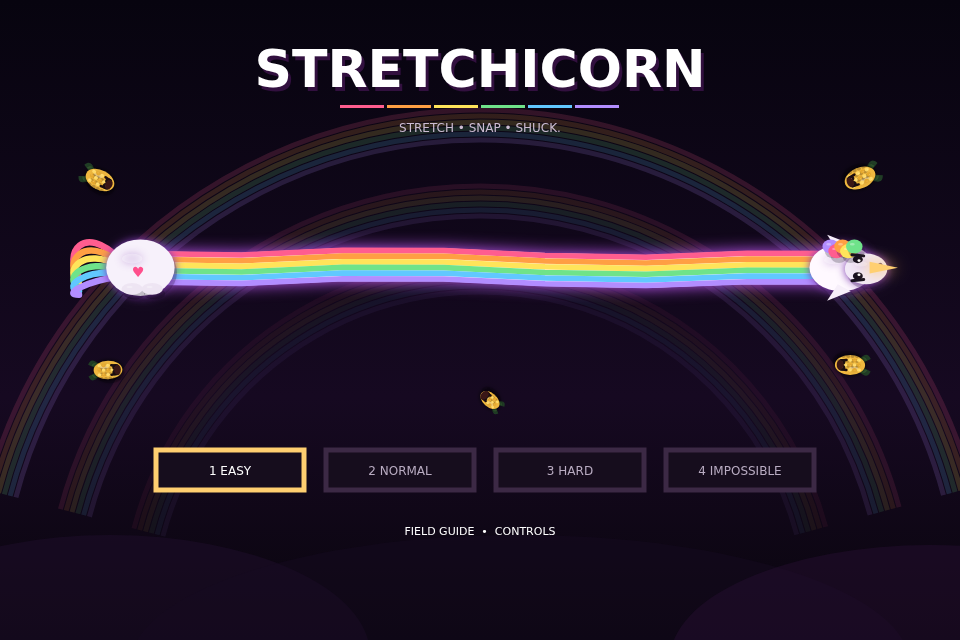
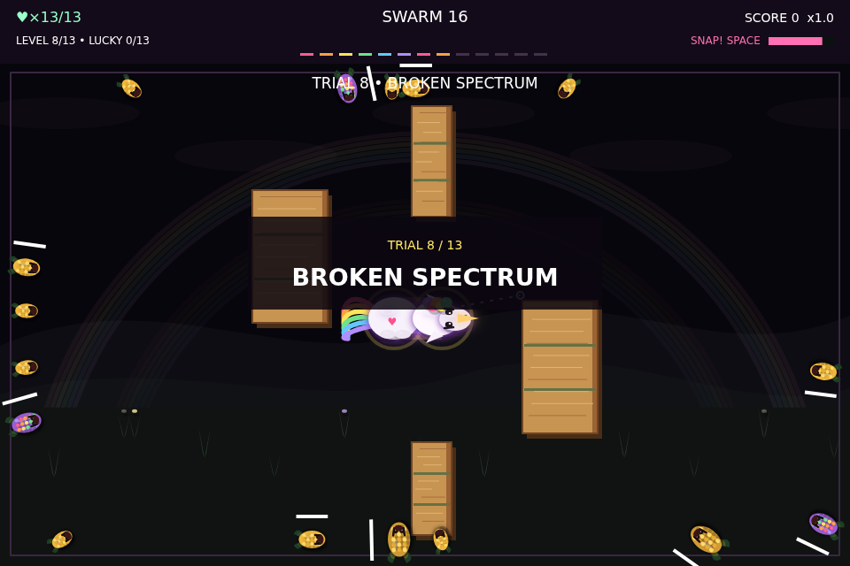
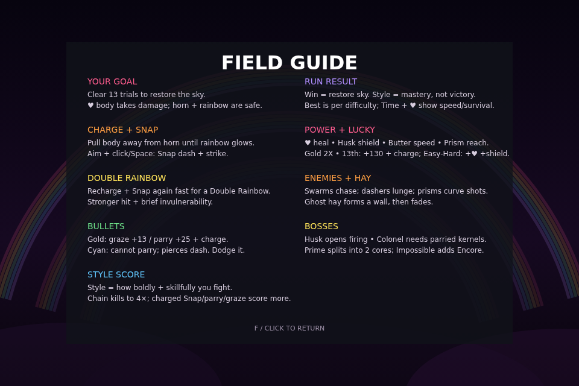
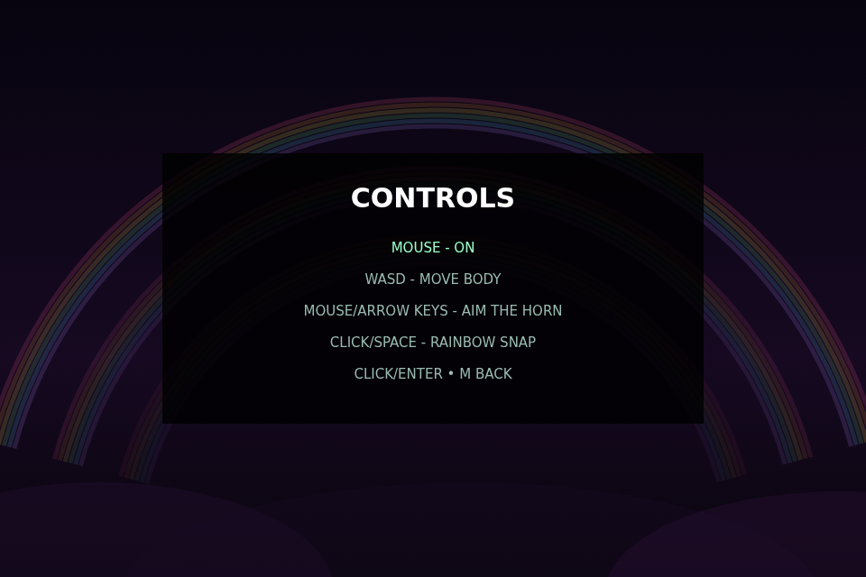
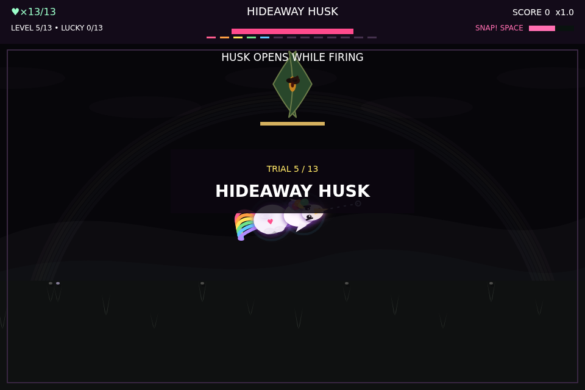
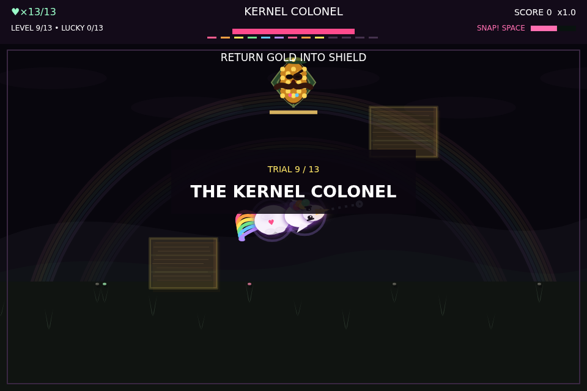
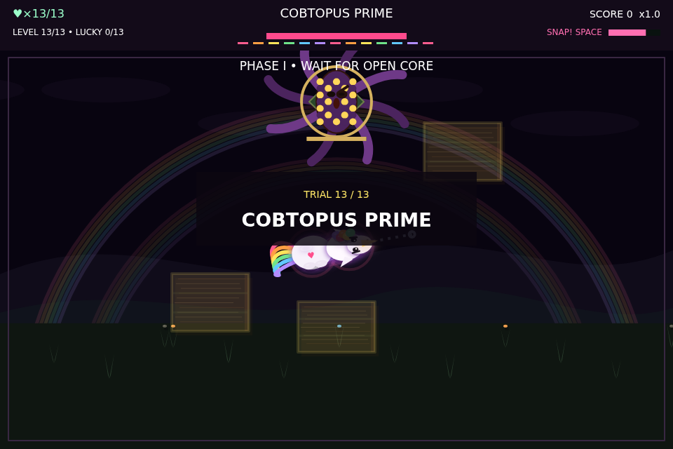
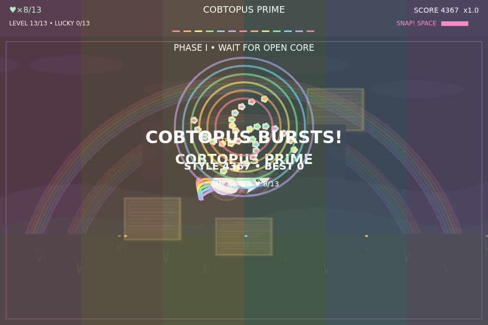
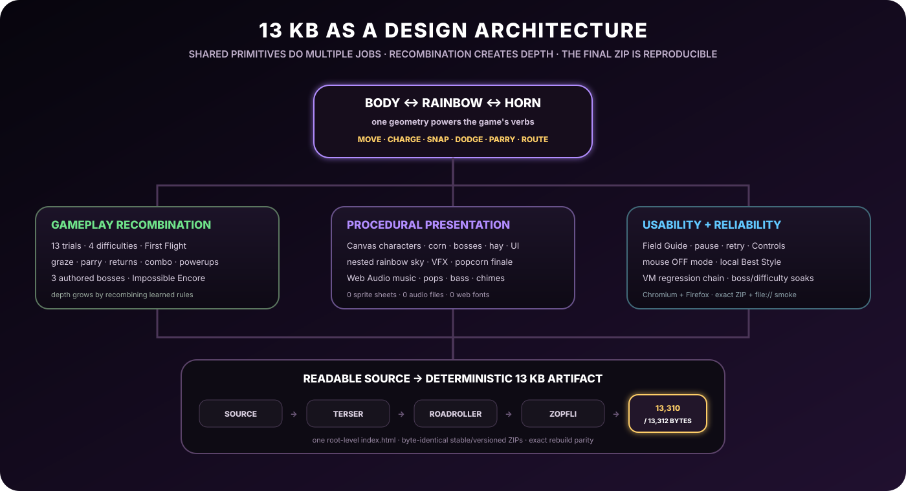

<div align="center">

# 🌽🦄 STRETCHICORN

### **STRETCH · SNAP · SHUCK.**



**A complete desktop arcade-action game packed into a 13,310 byte js13k ZIP.**

Stretchicorn is a desktop arcade-action game built for js13kGames 2026. You control a unicorn split into two linked parts: a vulnerable body and a safe horn. Pull them apart to charge the rainbow between them, then release that tension as a Rainbow Snap to dash, attack, parry incoming fire, and fight through 13 trials of hostile corn.

Built for **js13kGames 2026 · Unicorns & Rainbows**.

[**Play the standalone build**](dist/stretchicorn-local.html) · [**Download the 13 KB submission**](dist/stretchicorn-js13k.zip) · [**Release engineering**](RELEASING.md) · [**Play locally**](PLAY_LOCAL.md)

**13 trials · 4 difficulties · 3 authored bosses · Impossible Encore · 0 external runtime assets · 13,310 / 13,312 bytes**

</div>

---

## Why Stretchicorn is different

Stretchicorn is built around one spatial relationship rather than a collection of unrelated action-game buttons. The body and horn are controlled independently, while the rainbow stretched between them behaves like a spring. That same geometry becomes your movement system, attack line, defensive tool, parry surface, positioning problem and route through the arena.

The campaign keeps asking new questions with that same vocabulary. Early trials teach tension and Snap routing. Mid-game encounters add ranged fire, armored enemies and temporary cover. Late trials mix gold projectiles that can be converted into offense with cyan projectiles that must be dodged. Bosses change the rules of good positioning instead of simply adding larger health bars.

<div align="center">

<br><sub>Captured directly from the shipping standalone build. The screenshot uses the same runtime Canvas renderer as the 13 KB game.</sub>
</div>

### The design in six lines

| System | Design idea |
|---|---|
| **Body + horn** | Two independently controlled points create a constantly changing combat geometry. |
| **Rainbow Snap** | Stored tension becomes movement, attack, dodge routing and combo extension. |
| **Gold vs cyan** | Projectile color tells the player whether danger can become opportunity. |
| **13-trial campaign** | Mechanics accumulate and recombine instead of resetting every level. |
| **Boss grammar** | Each boss tests a different learned interaction rather than raw damage output. |
| **Style** | Clearing the campaign is victory; Style measures how boldly and skillfully you did it. |

---

# One creature, two control points

The vulnerable heart-body and safe horn deliberately ask the player to think about two places at once.

- **WASD** moves the vulnerable body.
- **Mouse / Arrow Keys** aim the horn.
- Moving the body away from the horn builds tension in the connecting rainbow.
- **Click / Space** releases that tension as a **Rainbow Snap**.
- Recharge and Snap again quickly to chain a stronger **Double Rainbow**.

The horn and rainbow can be thrown into danger. The body cannot. Good play therefore means shaping a useful line between the two points rather than simply steering a single avatar away from bullets.

### Controls

| Input | Action |
|---|---|
| **W A S D** | Move the vulnerable body / heart |
| **Mouse / Arrow Keys** | Aim the horn |
| **Left Click / Space** | Rainbow Snap |
| **1 / 2 / 3 / 4** | Start Easy / Normal / Hard / Impossible |
| **P** | Pause / resume |
| **F while paused** | Open the Field Guide |
| **C** | Open Controls from title or pause |
| **M** | Back / menu |

### Laptop-safe pointer mode

The Controls screen includes a persistent **MOUSE - ON / OFF** setting. Turning pointer gameplay OFF prevents an accidental touchpad movement from stealing horn aim and prevents accidental click-to-Snap, while **Arrow Keys + Space remain fully active**. Menu clicks still work, so the option can always be turned back on.

<table>
<tr>
<td width="50%"></td>
<td width="50%"></td>
</tr>
<tr>
<td align="center"><b>Field Guide</b><br><sub>The objective, combat rules, scoring and boss language remain available from the title and during a paused run.</sub></td>
<td align="center"><b>Controls</b><br><sub>Mouse gameplay can be disabled for laptop play without sacrificing keyboard aiming or Snap.</sub></td>
</tr>
</table>

---

# Rainbow Snap: one mechanic, several jobs

Pulling the body away from the horn charges the rainbow spring. Releasing it creates a Snap that is simultaneously:

- an attack,
- a burst of traversal,
- a dodge line,
- a multi-target route,
- a pickup collector,
- a combo extender,
- and a way to reposition the horn for the next decision.

The important constraint is that the player must continually rebuild useful geometry. Strong play becomes a rhythm of stretching, committing, recovering and choosing the next line instead of repeatedly pressing a dedicated attack button.

### Double Rainbow

Recharge and Snap again quickly enough and the game chains into **Double Rainbow**. The follow-up hits harder and grants a brief defensive window, rewarding players who can rebuild tension under pressure rather than treating Snap as a one-off escape.

---

# Combat is a color language

Stretchicorn tries to make projectile behavior readable before the player has time to read text.

### 🟡 Gold kernels: danger you can convert

Gold kernels can be:

- **grazed** near the vulnerable body for **+13 Style** and charge,
- **parried** with the horn for **+25 Style** and charge,
- **returned** into enemies and boss shields.

Returned fire rewards distance through **RETURN x2 / x3 / x4** tiers, so batting a projectile back across the arena is worth more than a close-range deflection.

### 🔷 Cyan spikes: danger you must respect

Cyan spikes deliberately break the conversion loop:

- they cannot be parried,
- they cannot be grazed for value,
- they can pierce ordinary dash protection,
- they must be dodged.

That distinction matters most in Hard and Impossible, where simply creating more enemies would actually make expert play easier by providing more combo targets. Cyan pressure forces strong players to preserve escape geometry instead of converting every threat into free offense.

---

# A finite 13-trial campaign

The campaign is designed as one growing vocabulary rather than thirteen isolated gimmicks.

| Campaign phase | What changes |
|---|---|
| **Early** | Learn body/horn separation, charging and direct Snap routing. |
| **Mid** | Add ranged kernels, parries, armor, static cover and denser formations. |
| **Late** | Mix curved fire, temporary hay, gold/cyan classification and stronger enemy combinations. |
| **Trial 13** | Cobtopus Prime combines the learned vocabulary, then changes target structure in Phase II. |

### Easy begins with the real game

Easy Trial 1 is **FIRST FLIGHT**. Instead of sending the player into a detached tutorial, it presents one practice target at a time and requires five genuine charged Snap kills using the production movement and combat rules.

The lesson is the actual game loop:

**pull away → build charge → aim → Snap → recover → repeat**

After the fifth successful Snap, the campaign simply continues into Trial 2.

### Four difficulties change decisions

| Mode | Intent |
|---|---|
| **Easy** | First Flight onboarding, forgiving pressure, retry the failed trial. |
| **Normal** | The baseline full-campaign rhythm. |
| **Hard** | Denser late encounters and stronger projectile-classification pressure. |
| **Impossible** | Expert anti-chain pressure, reduced sustain, stricter boss gates and Encore. |

Impossible was shaped by a useful playtest discovery: **adding more enemies can make Stretchicorn easier for a strong player**, because every extra body can become another combo target. The hardest mode therefore attacks the player's ability to convert pressure into offense rather than merely multiplying enemy count.

---

# Three bosses, three different questions

These are direct captures of the three authored bosses from the shipping game.

<table>
<tr>
<td width="33%"></td>
<td width="33%"></td>
<td width="33%"></td>
</tr>
<tr>
<td align="center"><b>Trial 5 · Hideaway Husk</b><br><sub>Wait for the firing window.</sub></td>
<td align="center"><b>Trial 9 · Kernel Colonel</b><br><sub>Turn incoming fire into the key.</sub></td>
<td align="center"><b>Trial 13 · Cobtopus Prime</b><br><sub>Combine the full combat vocabulary.</sub></td>
</tr>
</table>

### Hideaway Husk: offense creates the opening

Hideaway closes behind a real shield. Direct attacks do not leak through protected states. When the boss commits to firing, the shell opens and creates the punish window. The fight rewards waiting, reading and then committing rather than face-tanking the target.

### Kernel Colonel: return fire becomes the key

Colonel weaponizes the parry system. Reflected gold kernels are not merely bonus damage; they are part of the shield-opening grammar. The player has to receive an attack, reshape it and send it back with intent.

### Cobtopus Prime: combine the vocabulary

Prime begins with protected/open windows, then splits into **two independently gated cores**. Each core owns its own reflected-kernel requirement, and destroying one does not finish the encounter.

The return requirement scales with difficulty:

| Difficulty | Returns required per core |
|---|---:|
| Easy | 1 |
| Normal | 2 |
| Hard | 3 |
| Impossible | 4 |

Three rapid successful direct hits can also trigger a deterministic **PHASE SHIFT**. Damage already earned is preserved, but Prime relocates and forces the player to construct a new attack line. This breaks stationary pinning without resorting to arbitrary immunity or giant health pools.

### Impossible Encore

Clearing Trial 13 on Impossible is not quite the end. Encore recombines learned boss rules under expert pressure. Previously defeated targets stay defeated, stale projectiles are cleared during the transition, and the player must finish the remaining threats without relying on a single rehearsed script.

---

# Style is mastery, not victory

The win condition is deliberately simple: **clear all 13 trials and restore the sky**.

Style answers a different question: **how well did you fight while doing it?**

Style rewards the behaviors the combat system is built around:

- charged Rainbow Snaps,
- chained kills and a combo multiplier up to **4×**,
- gold-kernel grazes,
- parries,
- long-distance returns,
- wall-smash opportunities,
- Lucky 13 routing,
- sustained aggressive play without sacrificing survival.

Each difficulty stores its own **Best Style** locally in the browser. Once a player has recorded a score, the title screen also shows the highest saved Best across all four modes. There is no account or network dependency.

The result screen separates the run into understandable dimensions:

- **Victory**: did you restore the sky?
- **Style**: how skillfully and aggressively did you fight?
- **Time**: how quickly did you finish?
- **Hearts**: how cleanly did you survive?

<div align="center">

<br><sub>The player remains intact in the final gameplay pose while the defeated Cobtopus becomes the center of the celebration.</sub>
</div>

The final boss erupts into **rainbow popcorn**, moving the visual payoff toward the enemy that was just defeated and giving the run a clear, playful ending before the results settle in.

---

# Powerups, Lucky 13 and a changing arena

Five compact pickups reuse the same visual vocabulary as the rest of the world:

| Pickup | Effect |
|---|---|
| **♥ Heart Kernel** | Restore one heart, capped at 13. |
| **Husk Shield** | Absorb the next ordinary body hit. |
| **Butter Boost** | Temporary movement-speed increase. |
| **Prism Cob** | Adds charge and extends the useful rainbow reach. |
| **Gold Cob** | Doubles kill-point value temporarily. |

Every 13th kill triggers **Lucky 13** with +130 Style and bonus charge. Easy through Hard also receive the sustain portion of the reward; Impossible deliberately withholds that safety net.

Temporary hay barriers add another layer of geometry. They first appear as warning shapes, harden into real collision and cover, and later disappear to reopen the route. The same object can become shelter, obstruction, a wall-smash opportunity or a threat depending on the current fight.

---

# The graphics are code, not assets

All shipping game art is generated at runtime with **Canvas 2D** primitives. The competition archive contains no sprite sheets, raster game art, web fonts or external runtime resources.

That constraint became part of the art direction. A small family of shapes is reused aggressively:

- ellipses become bodies, kernels, eyes, highlights and medals,
- arcs become shields, telegraphs and the nested rainbow sky,
- curves become husks, tentacles, mane, tail and terrain,
- the six-color rainbow palette becomes character detail, combat feedback, progression and finale VFX,
- the corn visual grammar scales from small enemies to authored bosses,
- hay uses layered straw rows, depth shading and twine rather than a generic collision rectangle.

Because those shapes are shared, the game compresses well **and** looks like one coherent world.

### The sky is also progression

The background restores a nested rainbow family as the campaign advances: single rainbow, double rainbow, then triple rainbow. The title, campaign and ending all reuse that visual motif, turning scenery into a progress signal without paying for a separate level-art pipeline.

---

# Procedural audio: the corn has a synthesizer

All shipping audio is synthesized with the **Web Audio API**. A compact set of oscillator voices produces:

- rhythmic percussion,
- pitched kernel pops,
- melodic hooks,
- bass and wobble accents,
- Snap and hit feedback,
- boss coloration,
- victory chimes,
- a heavier Impossible / Encore texture.

Music and combat intentionally share sonic ingredients, so the soundtrack feels built out of the same corn-and-rainbow world instead of attached as an unrelated asset pack.

---

# What fits in 13 KB?

| System | Included in the competition build |
|---|---|
| **Campaign** | 13 authored trials with escalating enemy mixes and arena rules |
| **Movement** | independent vulnerable-body movement + safe horn aiming |
| **Combat** | charge, Snap, Double Rainbow, graze, parry, returns, wall smashes |
| **Bosses** | Hideaway Husk, Kernel Colonel, two-phase Cobtopus Prime |
| **Expert finale** | Impossible Encore |
| **Difficulty** | Easy, Normal, Hard, Impossible with mechanical differences |
| **Enemies** | swarms, dashers, shooters, curved-spread prisms, armored husks |
| **Projectiles** | gold parry/graze kernels + cyan dodge-only piercing spikes |
| **Arena** | static cover + warning/solid/disappearing hay barriers |
| **Powerups** | Heart, Husk Shield, Butter, Prism, Gold + Lucky 13 |
| **Scoring** | Style, combo multiplier, return tiers, persistent per-difficulty Best |
| **Onboarding** | Field Guide + Easy First Flight |
| **Controls** | keyboard, mouse, persistent laptop-safe pointer OFF mode |
| **Visuals** | procedural player, enemies, bosses, HUD, hay, terrain, sky and VFX |
| **Audio** | procedural Web Audio music + gameplay feedback |
| **Runtime assets** | **0 external assets** |

The shipping ZIP uses **99.985%** of the 13,312 byte limit. There are **2 bytes free**.

---

# 13 KB as an architectural constraint

<div align="center">

</div>

This is the one explanatory diagram kept in the main README because it describes the engineering architecture rather than attempting to imitate the game's visual presentation.

The size limit was treated as a design constraint rather than a packaging problem.

### One mechanic, many verbs

The body/horn/rainbow relationship produces movement, aiming, charging, attacking, dodging, grazing, parrying and routing without purchasing a separate subsystem for each action.

### Recombination beats accumulation

Late trials, bosses and difficulty modes mostly recombine mechanics the player already understands. Depth grows faster than code size.

### Reuse becomes visual identity

The same Canvas primitives that save bytes also make the characters, enemies, bosses, UI and sky feel related.

### Deletion is part of design

Development repeatedly removed weaker or redundant systems instead of preserving every experiment. Under a hard limit, a feature has to justify both its bytes and the complexity it adds to the player's mental model.

> **Make every byte do more than one job.**

---

# Exact release artifact

The current qualified competition build is:

```text
Stretchicorn v0.39.0
13,310 / 13,312 bytes
2 bytes free
SHA-256 ff8dc4532a654407be15d4b8f14f4c0a695b9cc712e13be56882c1347dd66912
```

The two committed ZIP names are byte-identical:

```text
dist/stretchicorn-js13k.zip
dist/stretchicorn-desktop-v0.39.0.zip
```

The competition archive contains exactly one root-level file:

```text
index.html
```

No network-capable runtime path is required by the shipping Desktop build.

---

# Release engineering

A game this aggressively compressed is easy to break in ways that are not obvious from readable source, so the repository treats the final ZIP as a reproducible artifact rather than a hand-built upload.

The production path is:

```text
readable source modules
        ↓
competition source composition
        ↓
safe identifier golf
        ↓
Terser 5.50.0
        ↓
Roadroller 2.1.0 with pinned deterministic model
        ↓
Zopfli 0.4.3 deterministic ZIP
        ↓
one root-level index.html
```

Roadroller is run deterministically, the committed `dist/` artifacts must match a clean rebuild, and the release audit verifies the exact archive size and fingerprint.

### Regression coverage includes

- First Flight progression and charged-Snap requirements,
- Field Guide and Controls navigation,
- pointer ON/OFF authority and stale-pointer suppression,
- pause and retry semantics,
- per-difficulty Best persistence and storage failure fallback,
- reflected-projectile single-resolution authority,
- boss shield/open-state contracts,
- Prime independent-core requirements and Phase Shift,
- Hard/Impossible cyan pressure,
- all Impossible Encore completion orders,
- safe-spawn invariants,
- deterministic multi-difficulty/boss soak tests,
- offline/network guards,
- deterministic package identity,
- exact submitted ZIP smoke tests in Chromium and Firefox,
- standalone `file://` smoke tests in Chromium and Firefox.

The goal is simple: **the source, transformed game, ZIP and browser behavior should all describe the same game.**

---

# Repository map

```text
src/                     readable game source
scripts/                 build, compression, audit and regression tooling
dist/
  index.html             packed competition HTML
  stretchicorn-local.html
  stretchicorn-js13k.zip
  stretchicorn-desktop-v0.39.0.zip
docs/
  screenshots/           captures taken directly from the shipping game
  stretchicorn-13k-architecture.svg
  design-review-v039.md
  difficulty-modes.md
  release-v039.md
```

Historical experiments and release artifacts remain available in Git history rather than cluttering the current shipping surface.

---

# Build it

Requirements:

- Node.js 22+
- Python 3.12+
- `zopfli==0.4.3`

```bash
npm run release:competition
```

That command rebuilds the game, executes the active regression manifest, packs the competition HTML, verifies offline behavior, creates deterministic ZIPs, audits release metadata and `dist/` hygiene, verifies archive identity and enforces the hard byte ceiling.

For direct local play:

```bash
npm run play:local
```

or open:

```text
dist/stretchicorn-local.html
```

See [`PLAY_LOCAL.md`](PLAY_LOCAL.md) and [`RELEASING.md`](RELEASING.md) for the complete development and release paths.

---

# Further design notes

The repository keeps deeper design history outside the README so the front page can remain focused on the finished game:

- [`docs/design-review-v039.md`](docs/design-review-v039.md) — final design review
- [`docs/difficulty-modes.md`](docs/difficulty-modes.md) — difficulty philosophy and mechanical deltas
- [`docs/rainbow-theatre-v0.22.md`](docs/rainbow-theatre-v0.22.md) — rainbow/world presentation work
- [`docs/heavy-drop-boss-theatre-v0.22.md`](docs/heavy-drop-boss-theatre-v0.22.md) — boss presentation work
- [`docs/release-v039.md`](docs/release-v039.md) — qualified release record

---

<div align="center">

## **One spring. Thirteen trials. 13,310 bytes.**

Stretchicorn's rainbow is a weapon, movement system, dodge route, charge meter and compositional spine. Its corn kernels are enemies, projectiles, pickups, boss motifs and percussion. Its background is scenery and progression. Its difficulty modes are balance settings and different mastery tests.

**The project is built around one principle: make a tiny game feel complete by designing every system to reinforce several others.**

</div>
