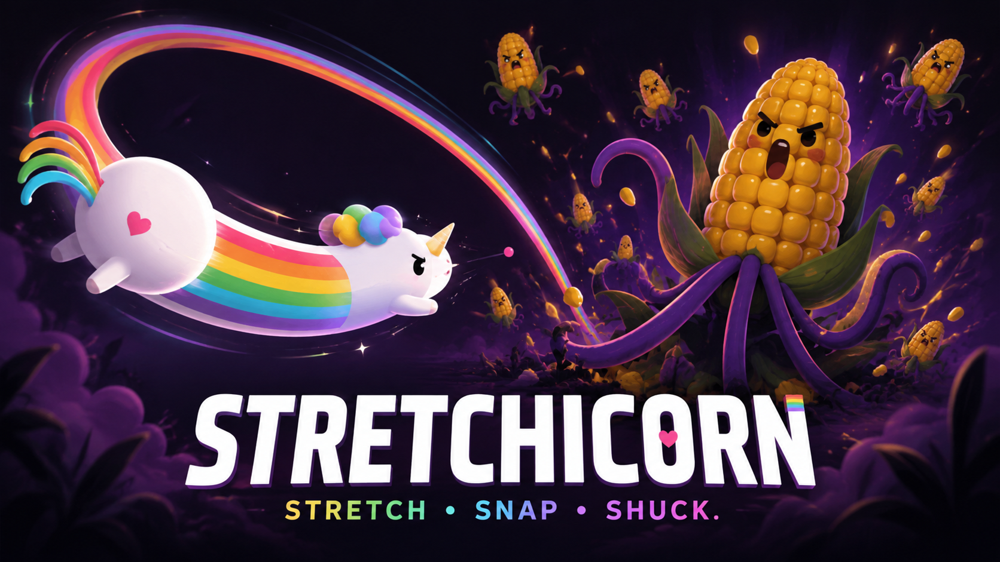
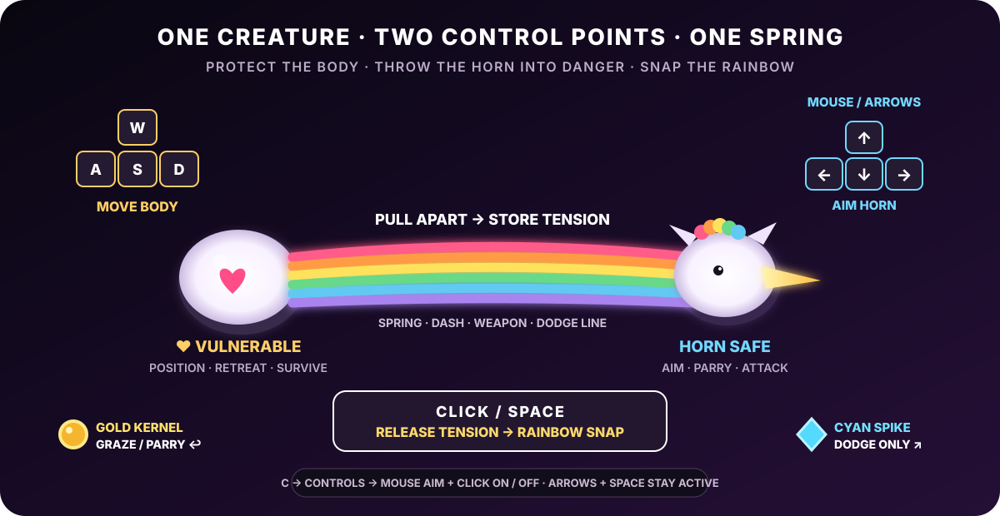
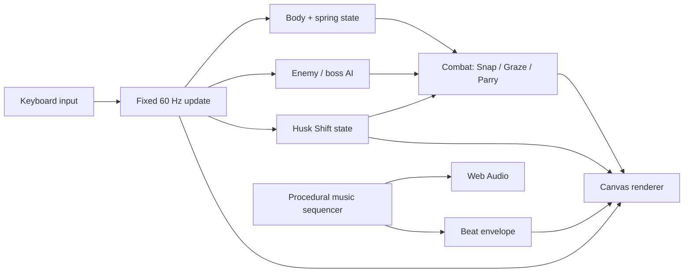

<div align="center">

<a href="docs/stretchicorn-hero.png"></a>

# 🌽🦄 STRETCHICORN

### **STRETCH · SNAP · SHUCK.**

**A tiny desktop action game where you play as an enchanted unicorn gifted the power to rainbow-stretch and fight off an army of angry corn across 13 chaotic trials!**

Built for **js13kGames 2026 · Unicorns & Rainbows**.

[**Download the current v0.20.6 competition ZIP**](dist/stretchicorn-desktop-v0.20.6.zip)

**13 hearts · 13 trials · way too much corn**

</div>

---

## What is Stretchicorn?

Stretchicorn is a fast arcade-action game built around one strange idea: **your unicorn is controlled from both ends**.

You move the vulnerable body with one hand, steer the safe head and horn with the other, then pull the two apart to charge the rainbow stretched between them.

```text
PULL ←     ♥ BODY ═══════ 🌈 RAINBOW ═══════ 🦄 HEAD / HORN     → AIM
           vulnerable         safe                 safe
```

Only the **♥ body** takes damage. The head and rainbow can safely reach into danger to attack, collect power-ups, parry kernels and prepare your next launch.

When the unicorn lights up, press **Space** and turn all that tension into a **Rainbow Snap**.

The result is part action game, part elastic slingshot, part bullet-dodging geometry puzzle, and part argument with a deeply unreasonable amount of corn.

---

## Gameplay in motion

<div align="center">


*Rainbow-stretch, line up the horn, snap through the corn, and try to keep all 13 hearts.*

</div>

This animation is captured directly from the game. The GIF, hero art and controls diagram are **README-only documentation assets** and are not included in the competition build. The **13KB submission remains a single generated HTML file**.

---

## The game in 30 seconds

1. **Move the ♥ body with WASD.** This is the part enemies can hurt.
2. **Aim the head with the Arrow Keys.** The horn rotates smoothly through continuous angles.
3. **Pull the body away from the horn.** That loads the rainbow spring.
4. **Watch the unicorn light up.** Glow + boing means Rainbow Snap is ready.
5. **Press Space.** Launch through enemies, projectiles and pickups.
6. **Turn, recharge and chain another Snap.** Good routes become Double Rainbows, Parries, Grazes and score.

The game rewards movement that does several jobs at once. A good launch can dodge a projectile, hit a cob, sweep through a power-up and set up the next attack before the rainbow finishes recoiling.

---

# 🎮 Controls

<div align="center">



</div>

| Input | Action |
|---|---|
| **W A S D** | Move the vulnerable ♥ body |
| **Arrow Keys** | Smoothly steer the safe head / horn |
| **Space** | Horn strike / Rainbow Snap |
| **P** | Pause / resume |
| **M** | Return to menu |
| **C** | Controls page |
| **R** | Rules page |
| **S** | Settings page |

### Custom controls

The Controls page supports persistent rebinding for all gameplay actions:

```text
↑ / ↓         select action
ENTER         begin rebinding
press a key   assign it
D             restore defaults
M / ESC       back
```

If a requested key is already assigned, the two bindings **swap** instead of creating an ambiguous duplicate. Bindings are stored in `localStorage`.

### Audio settings

Music and gameplay sounds have independent volume controls:

```text
Music        OFF / 25 / 50 / 75 / 100%
Game Sounds  OFF / 25 / 50 / 75 / 100%
```

That matters because Snap, Parry, Graze and damage sounds carry gameplay information while the background soundtrack is intentionally energetic.

---

# 🌈 Core mechanics

## Rainbow Spring

The unicorn is represented by two important points:

```text
A = vulnerable ♥ body
P = safe head / horn
```

The head is reconstructed from the body position, aim direction and one scalar spring length:

```text
P = A + aimVector × springLength
```

This keeps the character elastic **without sacrificing aiming precision**. Arrow input owns the angle, the spring owns the distance, and WASD movement loads the spring.

### Pull to charge

Spring charge is based on movement opposite the horn direction:

```text
charge contribution = dot(movementDirection, -aimDirection)
```

Pull straight backward and charge quickly. Move sideways and you get less. Move toward the horn and you do not load the spring.

A rear arrow shows the correct pull direction directly in the arena.

### Snap-ready feedback

When the threshold is reached:

- the whole unicorn glows,
- the rainbow brightens,
- particles appear,
- a procedural **boing** sounds.

The character itself becomes the meter, so the player does not need to stare at a HUD while dodging kernels.

## Rainbow Snap

A charged Space attack is several mechanics compressed into one verb:

- horn attack,
- dash,
- traversal,
- evasive movement,
- brief safety window,
- pickup routing,
- combo setup.

## Double Rainbow

Recharge and Snap again during the short follow-up window for extra reach, damage, particles and safety.

## Popcorn Graze

Skim a hostile kernel without touching the ♥ body to gain **+13 score and spring energy**.

```text
far      → safe
near     → GRAZE +13 + spring
contact  → damage
```

## Kernel Parry

Hit an incoming kernel with the horn to reflect it back into the corn army. Reflected kernels damage enemies, restore spring energy and create a brief breathing window.

## Lucky 13

Every 13 defeated enemies triggers a Lucky 13 burst with health, shield, spring energy, score and rainbow spectacle.

---

# 🌽 The corn army

The campaign mixes a compact roster of enemies with very different tactical roles:

| Enemy | What it asks from you |
|---|---|
| **Kernel Kamikaze** | Keep moving and protect the ♥ body |
| **Cob Charger** | Read the telegraph and redirect the charge |
| **Pop-Gunner** | Graze, Parry or route around ranged pressure |
| **Prism Popper** | Handle curved multi-shot patterns |
| **Husk Bruiser** | Commit to damage against armor |
| **Husk Ram** | Use geometry and punish recovery |
| **Maize Monarch** | Adapt through a four-phase mid-game boss |
| **Husk Architect** | Read dynamic terrain while fighting |
| **Cobtopus** | Combine everything in the final trial |

The game avoids simply scaling health upward. Difficulty comes from **more simultaneous decisions**.

---

# 🌽 Power-ups

Power-ups are tiny magical cobs that can be collected by the body **or anywhere along the stretched rainbow**.

| Pickup | Effect |
|---|---|
| **♥ Heart Kernel** | Restore one heart |
| **Husk Shield** | Absorb the next hit |
| **Butter Boost** | Temporary movement speed |
| **Prism Cob** | Easier spring charging |
| **Gold Cob** | Temporary 2× score |

Rainbow Snap temporarily increases collection reach, so efficient routes can attack and collect at the same time.

---

# 🧱 Husk Shift: dynamic arena geometry

Later trials introduce blocks that **warn, materialize, harden, protect, disappear and return somewhere else**.

```text
WARNING / MATERIALIZING   2.0 s
          ↓
SOLID COVER               2.35 s
          ↓
OPEN ARENA
          ↓
new layout + repeat
```

One warning footprint freezes around the current ♥ body location. It does not chase you. It simply gives you two seconds to react.

If the body is still inside when the block hardens, you lose a life and get knocked out of the new geometry.

Once solid, that same block becomes useful cover: it blocks hostile kernels and changes the available routes through the arena. Then it disappears, removing the protection again.

That creates a repeating decision:

```text
WARNING  → get out
SOLID    → can I exploit this cover?
OPEN     → survive without it
```

Enemies are ejected from forming blocks **without taking environmental damage**, so the arena cannot solve the boss fight for you.

### Trial 9: The Husk Architect

The Husk Architect is a 16-HP armored miniboss built to teach the dynamic-cover rhythm before the finale. It uses compact projectile fans when cover exists, then becomes more aggressive during the open interval.

### Trial 13: The Cobtopus

Cobtopus combines radial projectile patterns, multiple health phases and three-block Husk Shift formations. Each phase transition clears the current terrain, creating a deliberate **2.5-second no-cover window** before the next layout begins.

---

# 🏁 The 13 trials

1. **Pastel Patch**
2. **Kernel Panic**
3. **Popcorn Front**
4. **Husk Maze**
5. **The Maize Monarch**
6. **Butter Blitz**
7. **Husk Armor**
8. **Prism Popcorn**
9. **The Husk Architect**
10. **Sugar Corn**
11. **Kernel Gauntlet**
12. **Double Cornbow**
13. **The Cobtopus**

The progression intentionally teaches the game in layers:

```text
early game  → body/head separation + spring
mid game    → Graze / Parry / armor / mixed projectiles
late game   → mixed enemy roles + dynamic geometry
Trial 9     → learn Husk Shift
Trial 13    → solve Husk Shift while fighting Cobtopus
```

You begin with **13 hearts** so a first run has enough room to learn the unusual control language before the campaign begins demanding precision.

---

# 🎵 POP DROP: procedural gaming EDM

Stretchicorn ships with **no audio files**.

The soundtrack is synthesized at runtime with Web Audio oscillators and a tiny sequencer. The current direction deliberately uses short, readable sounds rather than sustained background bass that competes with combat.

The central idea is simple:

> **If kernels are already popping constantly, make the pop part of the instrument.**

The same pitched kernel-pop family appears in the soundtrack and in gameplay events such as Parries, Grazes, enemy deaths and pickups. The player therefore adds little accents to the music simply by playing well.

The set moves through arcade-EDM energy, trap-flavored switches and a high-speed peak:

```text
168 → 174 BPM   build
178 BPM         pop drop
150 BPM         half-time trap switch
162 BPM         sparse break
184 BPM         high-speed peak
176 BPM         drop variation
154 BPM         trap fill
repeat on a new root
```

A tiny shared beat envelope also drives subtle rainbow tears, sparks and specks in the background. No FFT or analyser is needed because the game already knows where its own beat is.

Every keyboard interaction also wakes/resumes the `AudioContext`, avoiding browser autoplay suspension issues.

---

# ✨ Visual and UX design

Everything in the competition build is procedural Canvas 2D.

The visual language is intentionally readable during chaos:

- bright white unicorn against a dark arena,
- rainbow body doubles as character and state feedback,
- distinct corn silhouettes for enemy recognition,
- exact horn trajectory reticle,
- pull-direction arrow,
- whole-unicorn Snap-ready glow,
- warning footprints drawn directly where future blocks will appear,
- large trial cards between encounters,
- separate Controls, Rules and Settings pages instead of a crowded title screen.

A recurring design rule is:

> **Put important information as close as possible to the thing it describes.**

---

# 🚀 Play and install

## Fastest way: use the competition build

1. Download [`dist/stretchicorn-desktop-v0.20.6.zip`](dist/stretchicorn-desktop-v0.20.6.zip).
2. Unzip it.
3. Open the included `index.html` in a modern desktop browser.
4. Press a key to begin. That user gesture also unlocks Web Audio.

The competition artifact is a self-contained single HTML file.

## Run the readable source locally

```bash
git clone https://github.com/sidhulyalkar/stretchicorn.git
cd stretchicorn
python3 -m http.server 8080
```

Then open:

```text
http://localhost:8080
```

## Build and verify

Requires Node.js and Python 3.

```bash
npm run build       # build dist/index.html
npm test            # regression tests against the built game
npm run smoke       # exact-artifact release smoke test
npm run package     # build + package + 13KB size check
npm run verify      # full release verification pipeline
```

---

# 🧠 Architecture

Stretchicorn is intentionally small enough that the source can be read as a complete game rather than a framework.

```text
stretchicorn/
├── index.html
├── src/
│   ├── 00-core.js       world state, stages, enemies, walls, spawning, audio core
│   ├── 01-combat.js     damage, Snap, Parry, Graze, Lucky 13
│   ├── 02-update.js     fixed-step movement, spring physics, AI, Husk Shift
│   ├── 03-render.js     Canvas renderer, HUD, corn/unicorn art, warnings
│   ├── 04-ui-input.js   title/menu/settings, rebinding, input, game loop
│   └── style.css
├── scripts/
│   ├── build.mjs
│   ├── package.py
│   ├── check-size.mjs
│   ├── test.mjs
│   └── release-smoke.mjs
└── dist/
    └── stretchicorn-desktop-v0.20.6.zip
```



### Fixed-step simulation

`requestAnimationFrame` drives presentation, but gameplay advances through a fixed **60 Hz accumulator**. That keeps spring behavior, enemy patterns and collisions much more consistent across different display refresh rates.

### One-dimensional spring, precise two-dimensional aim

A freely simulated 2-D head looked stretchy but caused aim drift. The final controller makes the angle authoritative and lets only the body-head distance behave elastically. This is the key compromise that makes Stretchicorn feel both weird **and** controllable.

### Shared systems do multiple jobs

The 13KB constraint rewards mechanics that multiply:

- Rainbow Snap = attack + movement + dodge + collection
- enemy kernel = hazard + Graze resource + Parry ammunition
- Husk block = warning + hazard + cover + route constraint
- kernel pop = music voice + game SFX
- beat clock = soundtrack timing + visual-reactivity timing

---

# 📦 13KB engineering

The current competition archive is:

```text
13,311 / 13,312 bytes
1 byte free
```

The runtime contains no external images, fonts, music files, frameworks or game engine.

The repository keeps readable source while the release builder safely compacts it into a single HTML file and packages that exact artifact. The release pipeline then tests the file that will actually be submitted rather than testing one version and shipping another.

---

# 🧪 Validation

The regression and smoke-test layers cover the unusual systems most likely to regress:

- all 13 stages spawn safely,
- spring and head states remain finite,
- Enter-based rebinding works,
- duplicate key assignments swap correctly,
- Music and SFX settings remain independent,
- Web Audio wakes from user input,
- horn attacks keep their snapshotted direction,
- Husk Shift warnings remain non-solid for two seconds,
- hardening damages and ejects the ♥ body,
- Husk Architect cannot kill itself on walls,
- Cobtopus receives genuine no-cover intervals,
- generated Canvas API calls remain valid,
- the exact competition ZIP stays below 13,312 bytes.

The v0.20.6 release was additionally exercised in a real Chromium Canvas runtime after a build-optimizer bug in v0.20.5 demonstrated why browser-level validation matters.

---

# 🔧 Current release: v0.20.6 HUSKSHIFT

The current patch focuses on late-game spatial pressure and release reliability.

### Why Trial 9 changed

The previous Cob Crusher could be beaten by waiting near the middle while it repeatedly damaged itself against walls. That meant the arena was solving the encounter for the player.

The Husk Architect redesign replaces passive cheese with a mechanic that asks the player to:

```text
read future terrain
      ↓
move before it hardens
      ↓
use it briefly as cover
      ↓
survive when the cover disappears
      ↓
attack during a good route
```

The same rule returns in the Cobtopus fight, so Trial 9 teaches rather than merely surprises.

### v0.20.5 → v0.20.6 build fix

v0.20.5 exposed a release-blocking optimizer bug. A naive identifier-golf pass renamed the game's internal `save` helper and accidentally rewrote the native Canvas call `X.save()` as well, freezing the title screen after partial rendering.

v0.20.6 fixes the build system by preserving browser/API member names and only golfing explicitly vetted internal identifiers. The compiled artifact is also scanned for suspicious rewritten Canvas calls before packaging.

<details>
<summary><strong>Recent release history</strong></summary>

### v0.20.6 · HUSKSHIFT FIX
- Fixed the Canvas API rename bug in the competition build.
- Hardened identifier golfing and exact-artifact validation.
- Preserved Husk Architect, dynamic blocks, POP DROP audio and the full campaign.

### v0.20.5 · HUSKSHIFT
- Replaced Cob Crusher with the Husk Architect.
- Added 2-second dynamic block warnings, hardening damage and temporary cover.
- Added open-arena windows to Trial 9 and Cobtopus.

### v0.20.4 · POP DROP
- Replaced difficult-to-hear sustained WUB/YOI layers with pitched kernel-pop hooks.
- Added arcade-EDM, trap-switch and high-BPM sequence variation.
- Fixed browser audio unlocking.

### v0.20.2 · MIXER
- Added independent persistent Music and Game Sounds controls.

### v0.20.0 · SETFLOW
- Improved continuous aiming, exact horn trajectories and pull-direction feedback.

See [`CHANGELOG.md`](CHANGELOG.md) for the longer development history.

</details>

---

## Credits

Designed and built for **js13kGames 2026** around the theme **Unicorns & Rainbows**.

No external runtime assets. Just JavaScript, Canvas, Web Audio, one stretchy unicorn, and a corn problem that got considerably out of hand. 🌈🦄🌽
