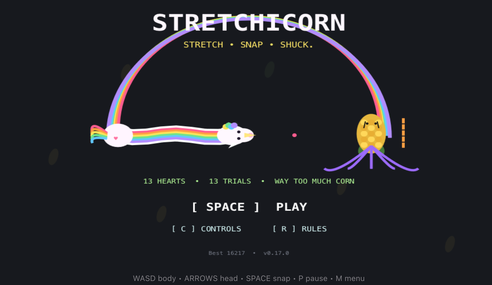

<div align="center">

<a href="docs/stretchicorn-hero.png"></a>

# 🌽🦄 STRETCHICORN

### **STRETCH · SNAP · SHUCK.**

A tiny desktop action game where **your body is your health, your head is your weapon, and the rainbow between them is a spring**.

Built for **js13kGames 2026 · Unicorns & Rainbows**.

[**Download the v0.20.6 competition ZIP**](dist/stretchicorn-desktop-v0.20.6.zip)

**13 hearts · 13 trials · way too much corn**

</div>

---

## Current release: v0.20.6 HUSKSHIFT

v0.20.6 is the current stable competition build. It keeps the responsive elastic controller, POP DROP procedural music, persistent mixer, custom controls, corn power-ups and 13-stage campaign while completely rebuilding one late-game encounter around a new spatial mechanic.

```text
13,311 / 13,312 bytes
1 byte free
```

The submission contains **no image assets, audio files, fonts, frameworks or game engine**. Runtime visuals are Canvas 2D. Runtime music and sound are Web Audio oscillators. Gameplay is compact fixed-step JavaScript.

The promotional images in this README are repository documentation only and are not in the competition ZIP.

<div align="center">

<a href="docs/stretchicorn-title-v017.png"></a>

</div>

---

# The central idea

Stretchicorn is not a conventional single-hitbox action character.

You control two linked points:

```text
PULL ←     ♥ BODY ═══════ 🌈 RAINBOW ═══════ 🦄 HEAD / HORN     → AIM
           vulnerable         safe                 safe
```

Only the **♥ body** takes damage. The head and rainbow are safe, which means dangerous space can be used offensively instead of simply avoided.

That one rule drives movement, aiming, attack geometry, projectile parries, power-up routing and the spring system.

---

# Why HUSKSHIFT exists

Trial 9 used to feature the **Cob Crusher**, a heavy charger inside an arena with permanent walls. The intention was to create a late-game positioning test. In actual play, a much weaker strategy emerged:

> wait near the middle and let the boss repeatedly collide with the arena until it damages itself.

That was not merely a tuning problem. It meant the arena could solve the encounter for the player.

Instead of adding HP or making the charger faster, the encounter was redesigned around a stronger set of principles:

1. **Standing still should not be optimal.**
2. **Danger should be telegraphed before becoming lethal.**
3. **The same geometry should become both hazard and opportunity.**
4. **The boss must not die from environmental automation.**
5. **The mechanic should teach a skill that returns in the final boss.**
6. **The mechanic must respect the game's core rule that only the ♥ body is vulnerable.**

The result is **Husk Shift**.

---

# 🧱 Husk Shift: geometry that changes jobs

Trials 9 and 13 now use blocks that materialize, harden, become cover, disappear and return in new layouts.

Every formation has a readable cycle:

```text
WARNING / MATERIALIZING      2.0 s
             ↓
SOLID COVER                  2.35 s
             ↓
OPEN ARENA                   1.4 s in Trial 9
                             2.5 s vs Cobtopus
             ↓
new formation
```

During the warning phase, incoming block footprints are translucent and visibly fill toward hardening.

One warning block is positioned around the player's **current ♥ body location when the cycle begins**. That location is then frozen. The block does not chase the player after the warning starts.

The message is intentionally simple:

```text
You were standing here.
This space hardens in 2 seconds.
Move.
```

If the body remains inside when hardening occurs, the player loses one life and receives knockback that physically ejects the body from the new wall.

## Why exactly two seconds?

Stretchicorn already asks the player to steer a safe head, move a vulnerable body, judge spring charge and read projectile lanes. The warning therefore needs to be long enough to understand while other decisions are happening, but short enough that ignoring it has consequences.

Two seconds creates roughly one deliberate repositioning decision rather than a frame-perfect reflex test.

## Why the block becomes useful after threatening you

A purely punitive hazard would increase cognitive load without adding much strategy. Hardened blocks immediately reverse role:

```text
warning phase  →  GET OUT
solid phase    →  CAN I USE THIS?
open phase     →  NOW I HAVE NO COVER
```

Solid Husk Shift blocks:

- collide with the vulnerable body,
- constrain the head/rainbow extension ray,
- absorb hostile kernels,
- create temporary projectile-safe lanes,
- then disappear completely.

The same object must therefore be reinterpreted continuously rather than memorized as simply "good" or "bad".

## Anti-cheese rule

Enemies caught inside a materializing block are **ejected without taking damage**.

That rule exists specifically because the old Cob Crusher demonstrated what happens when automated geometry becomes the dominant damage source. The environment can alter positioning, but the player still has to defeat the encounter.

---

# 🌽 Trial 9: THE HUSK ARCHITECT

The Cob Crusher is gone.

Trial 9 now introduces **The Husk Architect**, a dedicated 16-HP armored miniboss built around space control.

The Architect cannot hurt itself by bouncing into walls. Charged Rainbow Snaps remain the efficient answer to its armor.

Its pressure also changes with the arena state.

### While cover exists

The Architect orbits and fires compact **three-kernel fans**. The player must read projectile lanes while watching the incoming block footprint.

### During the open interval

The Architect accelerates and fires wider **five-kernel fans**. There is no bunker and no permanent safe corner.

The intended loop becomes:

```text
READ the materialization footprint
        ↓
RELOCATE the vulnerable body
        ↓
USE temporary cover
        ↓
SURVIVE the open arena
        ↓
CHARGE + SNAP through a deliberate lane
        ↓
repeat under rising pressure
```

This is deliberately a teaching boss. Trial 9 introduces the spatial language before Trial 13 asks the player to use it while fighting the final boss.

---

# 🐙 Cobtopus: no permanent bunker

The final Cobtopus encounter now remixes Husk Shift instead of relying on permanent walls.

Cobtopus formations can contain three temporary blocks. They still warn for two seconds and remain solid for 2.35 seconds, but the final fight includes a longer **2.5-second completely open arena** interval.

That means the player cannot solve the finale by locating one permanently protected position.

Every Cobtopus health-phase transition also clears current cover immediately:

```text
boss phase changes
        ↓
all cover disappears
        ↓
open-arena projectile pressure
        ↓
new 2-second warning
        ↓
new tactical layout hardens
```

This gives boss phases a physical rhythm rather than merely increasing projectile count.

Temporary cover is valuable, but camping remains unstable because a later formation can target the exact body position where the player waited.

---

# Controls

| Input | Action |
|---|---|
| **W A S D** | Move the vulnerable ♥ body |
| **Arrow Keys** | Smoothly steer the safe head |
| **Space** | Horn strike / Rainbow Snap |
| **P** | Pause / resume |
| **M** | Return to menu |
| **C** | Controls page |
| **R** | Rules page |
| **S** | Settings page |

The gameplay intentionally uses very few buttons. Depth comes from the relationship between movement vector, aim vector, spring length and timing.

## Custom rebinding

The Controls page supports persistent rebinding for all nine gameplay actions:

```text
↑ / ↓         select action
ENTER         begin rebinding
press a key   assign it
D             restore defaults
M / ESC       back
```

If a requested key is already assigned, the two bindings **swap** instead of creating an ambiguous duplicate. Custom mappings persist with `localStorage`.

## Settings / mixer

Music and game sounds are independent:

```text
Music        OFF / 25 / 50 / 75 / 100%
Game Sounds  OFF / 25 / 50 / 75 / 100%
```

Use Up/Down to choose a row and Left/Right or Enter to adjust it. Values persist locally.

---

# 🌈 The elastic controller

The player is represented by two meaningful points:

```text
A = vulnerable ♥ body
P = safe head / horn
```

The head is reconstructed from an authoritative aim direction and a single scalar spring length:

```text
P = A + aimVector × springLength
```

Earlier prototypes allowed the head to behave as a freely moving two-dimensional spring body. That looked elastic, but movement could drag the head away from the player's intended attack direction.

The current architecture separates precision from elasticity:

```text
Arrow keys       → authoritative angle
Spring length    → elastic distance
WASD             → body movement + spring loading
```

The head can rotate through arbitrary intermediate angles instead of being restricted to eight directions.

A dashed ray and endpoint reticle show the exact horn trajectory. A second arrow behind the body shows the opposite pull direction and brightens as movement aligns correctly for charging.

## Deterministic horn direction

The instant Space is pressed, the game snapshots the attack angle:

```text
aim ↗
SPACE
  ↓
kickA = aim
  ↓
rendering + collision + parry + knockback all use kickA
```

Movement can continue during the strike, but rotating the head cannot bend an attack after commitment. What the player saw when pressing Space is what the collision system uses.

---

# Rainbow Spring and combat grammar

Spring charge is based on movement opposite the horn direction:

```text
away = dot(movementDirection, -aimDirection)
```

A short purposeful pull should be enough to enter the main combat loop. The spring is meant to become normal movement vocabulary, not a rare super meter.

When Snap is ready, the game combines several cues:

- a procedural boing,
- rainbow particles,
- a pulsing head ring,
- a whole-unicorn rainbow aura.

The character itself becomes the readiness meter.

## Rainbow Snap

A charged Space press combines offense and movement:

- horn attack,
- forward launch,
- evasive traversal,
- brief safety,
- combo extension,
- power-up routing.

One mechanic doing several jobs is important for both game feel and byte efficiency.

## Double Rainbow

After a Snap there is a short chaining window. Recharge and Snap again before it expires for a stronger follow-up with extra reach and safety.

## Popcorn Graze

Hostile kernels have a narrow near-miss ring around the ♥ body:

```text
far away     → safe
near miss    → +13 score + spring energy
body contact → damage
```

Enemy fire is therefore not only a hazard. Skilled players can convert risk into resources.

## Kernel Parry

Hit an incoming kernel with the horn and ownership flips. The reflected projectile travels back into the corn army, awards score and restores spring energy.

## Lucky 13

Every 13 defeated enemies triggers a Lucky 13 burst with health, shield, spring energy, score and rainbow spectacle.

---

# 🌽 Power-ups

Power-ups are tiny magical cobs rather than abstract circles.

| Pickup | Effect |
|---|---|
| **Heart Kernel** | Restore one heart |
| **Husk Shield** | Absorb the next hit |
| **Butter Boost** | Temporary faster movement |
| **Prism Cob** | Easier spring charging |
| **Gold Cob** | Temporary 2× score |

The entire stretched rainbow can collect them, so route planning matters more than placing the vulnerable body directly on the item.

---

# 🌽 Enemy vocabulary

| Enemy | Role |
|---|---|
| **Kernel Kamikaze** | Fast body pressure |
| **Cob Charger** | Telegraph, charge, recover |
| **Pop-Gunner** | Ranged Graze / Parry pressure |
| **Prism Popper** | Curved multi-shot pressure |
| **Husk Bruiser** | Armored pursuer |
| **Husk Ram** | Heavy armored charger |
| **Maize Monarch** | Mid-campaign multi-phase boss |
| **Husk Architect** | Dynamic-cover miniboss and spatial teacher |
| **Cobtopus** | Final boss combining projectile phases and Husk Shift |

---

# 🎵 POP DROP procedural soundtrack

Earlier audio experiments tried to fit sustained dubstep growls and talking-bass synthesis into the game. In practice, Stretchicorn already produces a lot of useful sound through kills, parries, grazes, Snap impacts, projectiles and power-ups.

The better design question became:

> **What if gameplay noise itself helped complete the music?**

POP DROP uses short, speaker-friendly pitched kernel pops as its melodic identity instead of maintaining a dense wall of bass behind combat.

The macro set moves through arcade/gaming-EDM and trap-flavored sections roughly in the 150 to 184 BPM range:

```text
BUILD / ARCADE GROOVE
        ↓
POP DROP
        ↓
TRAP SWITCH
        ↓
SPARSE BREAK
        ↓
HIGH-SPEED PEAK
        ↓
DROP VARIATION
        ↓
TRAP FILL
        ↓
new root + repeat
```

The same tiny pitch-drop `kernel pop` voice is reused for musical notes and selected gameplay events such as enemy kills, Parries, Grazes, shield pops and pickups.

So the player naturally adds punctuation to the track while fighting.

### Browser audio reliability

Every keyboard interaction calls a lightweight `wake()` helper that creates and resumes the Web Audio context inside a user gesture. This avoids browsers silently leaving the procedural soundtrack in a suspended autoplay state.

### Audio-reactive background

The game does not run FFT analysis. Since the sequencer already knows when meaningful beats occur, those events raise a shared `beat` envelope that drives subtle rainbow tears, sparks and specks in the background.

The effect is deliberately low-contrast so gameplay stays readable.

---

# 13 trials

1. Pastel Patch
2. Kernel Panic
3. Popcorn Front
4. Husk Maze
5. The Maize Monarch
6. Butter Blitz
7. Husk Armor
8. Prism Popcorn
9. **The Husk Architect**
10. Sugar Corn
11. Kernel Gauntlet
12. Double Cornbow
13. **The Cobtopus**

The late-game progression is intentional: Trial 9 introduces changing geometry as the primary problem, then Trial 13 layers the same spatial grammar beneath a denser final-boss projectile fight.

---

# Three budgets, not one

The 13KB constraint is not treated purely as a compression exercise. Every feature is evaluated against three budgets.

## 1. Byte budget

Can one tiny system perform several jobs?

Examples:

- Rainbow Snap is attack, movement and traversal.
- Husk Shift is hazard, cover, projectile blocker and boss-phase punctuation.
- Kernel-pop synthesis is both music and gameplay feedback.
- The sequencer beat envelope drives visuals without an analyser.

## 2. Attention budget

Can a new player read the mechanic while angry corn is shooting at them?

This is why Snap readiness appears on the unicorn itself, Husk Shift has a visible two-second fill, and the aim/pull geometry is drawn directly into the arena.

## 3. Decision budget

Does the feature create an interesting choice?

A block that only hurts you is a rule to memorize. A block that first threatens you, then protects you, then vanishes creates a sequence of decisions.

---

# Release engineering: test the thing we actually ship

v0.20.5 exposed a second kind of design failure, this time in the build pipeline.

A size-golf pass used an internal helper called `save`. The optimizer renamed every `save` token, including the native Canvas call:

```js
X.save()
```

which became an invalid member call equivalent to:

```js
X._Z()
```

A browser reached that call during title rendering, threw an exception and left the game frozen halfway through drawing the character.

The important lesson was not merely "fix that token." It was:

> **A byte-constrained release must test the exact artifact that gets shipped, and compression must never be allowed to rewrite browser APIs blindly.**

v0.20.6 therefore hardens the release path:

```text
readable source
      ↓
safe comment / whitespace compaction
      ↓
only explicitly vetted internal identifiers may be shortened
      ↓
exact dist/index.html
      ↓
regression test that exact compiled HTML
      ↓
release smoke test
      ↓
real-browser Canvas verification
      ↓
ZIP that exact HTML
      ↓
size check
```

The automated tests also reject suspicious rewritten Canvas member names before release.

The exact v0.20.6 artifact was verified with zero page errors in a real Chromium Canvas runtime before packaging.

---

# Verification

Run:

```bash
npm run verify
```

The release suite checks, among other things:

- exact compiled HTML executes,
- Enter starts the game and unlocks audio,
- Music/SFX settings work independently,
- Enter-based custom rebinding works,
- duplicate bindings swap safely,
- procedural POP DROP audio schedules,
- horn direction remains fixed during an active attack,
- Trial 9 spawns the 16-HP Husk Architect,
- Husk Shift warnings are non-collidable for exactly two seconds,
- hardening damages and ejects an overlapping ♥ body,
- the Architect cannot self-damage against walls,
- blocks clear after the solid phase,
- Cobtopus receives genuine no-cover windows,
- all 13 stages spawn safely,
- sustained simulation remains finite,
- the final ZIP remains within 13,312 bytes.

Current verified result:

```text
dist/index.html 33312 bytes
PASS: HUSKSHIFT hazards/Architect + Cobtopus no-cover,
      audio/mixer/rebinds, precise horn, 13 safe stages
PASS: exact dist loads; HUSKSHIFT impact + Cobtopus clear windows,
      audio/mixer/rebind, all 13 stages stable
dist/stretchicorn-desktop-v0.20.6.zip 13311 bytes
```

---

# Repository layout

```text
stretchicorn/
├── README.md
├── CHANGELOG.md
├── index.html
├── package.json
├── netlify.toml
├── src/
│   ├── 00-core.js
│   ├── 01-combat.js
│   ├── 02-update.js
│   ├── 03-render.js
│   ├── 04-ui-input.js
│   └── style.css
├── scripts/
│   ├── build.mjs
│   ├── package.py
│   ├── check-size.mjs
│   ├── test.mjs
│   └── release-smoke.mjs
├── dist/
│   └── stretchicorn-desktop-v0.20.6.zip
└── docs/
    ├── stretchicorn-hero.png
    └── stretchicorn-title-v017.png
```

`dist/index.html` is generated by `npm run build`. The exact competition ZIP is committed so the tested submission artifact is preserved.

---

# Why this game exists

The project is an experiment in using a severe size limit as a game-design tool.

Instead of asking how many systems can fit into 13KB, Stretchicorn asks how many **interesting consequences** can come from a few systems that overlap.

The rainbow is simultaneously body, spring, traversal path, pickup collector and visual identity. Enemy projectiles are simultaneously danger, Graze resource and Parry ammunition. Temporary walls are simultaneously warning, punishment, cover and boss pacing. Kernel pops are simultaneously soundtrack and combat punctuation.

That overlap is where the game tries to earn its bytes.

<div align="center">

### 🌈🦄🌽 **STRETCH · SNAP · SHUCK.**

</div>
