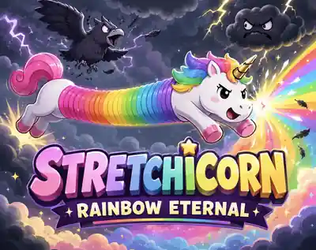
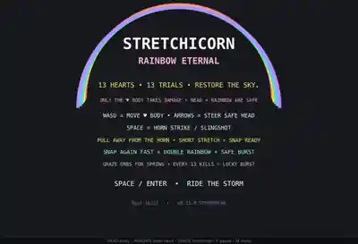

<div align="center">



# Stretchicorn: Rainbow Eternal

### 13 hearts · 13 trials · restore the sky 🌈🦄⚡

**A tiny desktop action game about stretching a unicorn into a rainbow weapon.**  
Built for **js13kGames 2026 — Unicorns & Rainbows**.

</div>

---

## About

**Stretchicorn: Rainbow Eternal** is a fast, strange, skill-based arcade game built around one deliberately ridiculous idea:

> **Move the vulnerable unicorn body, steer the safe head, stretch the rainbow between them, then release that tension as an attack.**

You have **13 hearts** and **13 trials** to break the storm and restore color to the sky.

The game is designed as a **Desktop-first js13kGames entry**. Everything is rendered procedurally with Canvas and Web Audio: no image assets, no audio files, no frameworks, and no game engine inside the competition build.

<div align="center">



</div>

---

## Controls

| Input | Action |
|---|---|
| **W A S D** | Move the vulnerable ♥ body |
| **Arrow Keys** | Smoothly steer the safe head |
| **Space** | Horn strike / Rainbow Snap |
| **P** | Pause |
| **M** | Return to menu |

### The most important rule

**Only the ♥ body takes damage.**

The head and stretched rainbow are safe, so learning to place the body while using the head and rainbow aggressively is a core part of the game.

---

## Core Mechanics

### 🌈 Rainbow Spring

Move the body away from the horn direction to stretch the rainbow spine.

A short, intentional pull charges the spring. Once charged, release it with **Space** to launch a **Rainbow Snap**.

The spring is not just a meter. It is the character, the movement system, the weapon, and much of the game's visual language.

### ⚡ Rainbow Snap

A charged spring attack launches Stretchicorn forward with a burst of rainbow energy.

Use it to:

- burst through enemies,
- escape dangerous bullet patterns,
- cross the arena quickly,
- collect distant power-ups,
- continue score chains,
- reposition for the next spring.

### 🌈🌈 Double Rainbow

Recharge and Snap again quickly after a successful Rainbow Snap to trigger **Double Rainbow**.

The follow-up attack is stronger, safer, and designed to reward aggressive chaining rather than passive survival.

### ✨ Glitter Graze

Enemy projectiles are not only hazards.

Pass close to a projectile without getting hit and you earn a **Glitter Graze**, gaining score and spring energy.

The risk ladder is intentional:

- stay far away → safest,
- graze → charge spring,
- parry → weaponize the projectile,
- collide → lose a heart.

### 💎 Prism Parry

Hit hostile projectiles with the horn to reflect them.

A successful parry also restores spring energy, creating opportunities for Snap → Parry → Double Rainbow sequences.

### 🍀 Lucky 13

Every **13 defeated enemies** triggers a Lucky 13 burst:

- +1 heart, up to 13,
- instant shield,
- spring energy,
- score bonus,
- rainbow spectacle.

The number 13 is woven into the game rather than appearing only as a file-size joke.

---

## The Sky

The campaign contains **13 stages** of increasingly hostile weather.

Storm birds, gloomy clouds, lightning creatures, armored threats, walls, curved projectile patterns, power-ups, bosses, and the final **Voidbow** are all built from tiny Canvas primitives.

As stages are cleared, the storm gradually weakens and color returns to the horizon.

Defeated storm creatures also regain a little personality:

- birds shed rainbow feathers,
- gloomy clouds briefly turn into smiling white clouds,
- the final storm transforms as the sky is restored.

The goal is not merely to survive the storm.

**You are painting the sky back into existence.**

---

## Power-ups

| Power-up | Effect |
|---|---|
| ♥ **Heart** | Restore one heart |
| ☁ **Cloud Puff** | Absorb the next hit |
| » **Sugar Rush** | Temporary movement boost |
| ★ **Star Power** | Easier spring charging |
| **2× Horseshoe** | Temporary score multiplier |

The stretched rainbow body can collect power-ups, making spring positioning useful even when you are not attacking.

---

## Bosses

Bosses use four escalating phases based on remaining health.

Each phase changes attack pressure, visual feedback, and projectile behavior so players can read their progress rather than fighting an opaque damage sponge.

The final Level 13 encounter introduces the **Voidbow** with a dedicated entrance and ends in the full **Rainbow Eternal** victory sequence.

---

## Technical Constraints

Stretchicorn is intentionally built inside the js13kGames constraint box.

- **Single-file HTML competition build**
- **Canvas 2D rendering**
- **Procedural Web Audio**
- **No external runtime assets**
- **No frameworks or engine**
- **Desktop keyboard controls**
- **13,312-byte compressed competition limit**
- Current development line: **v0.15.x / Stormbreak**

The tiny size is part of the design. Mechanics are intentionally constructed so one small system can serve several purposes.

For example, the rainbow spring simultaneously acts as:

1. character animation,
2. charge feedback,
3. movement system,
4. attack system,
5. pickup-routing tool,
6. thematic centerpiece.

---

## Running Locally

The competition build is self-contained.

For a quick local test, open:

```text
index.html
```

in a modern desktop browser.

For the most reliable local behavior, especially while developing, serve the repository with any small static HTTP server rather than opening the file directly.

Example:

```bash
python3 -m http.server 8080
```

Then visit `http://localhost:8080`.

---

## Repository Layout

Repository structure:

```text
stretchicorn/
├── index.html                 # current playable desktop build
├── README.md
├── docs/
│   ├── cover.webp
│   └── title-screen.webp
├── src/
│   └── index.html             # source snapshot
├── dist/
│   ├── index.html
│   └── stretchicorn-rainbow-eternal-desktop-v0.15.0.zip
├── scripts/
│   └── check-size.mjs
├── package.json
└── netlify.toml
```

`src/index.html` currently preserves the single-file source snapshot used for the playable build. Before the final js13kGames submission, the source will remain available here alongside the byte-golfed competition artifact so the implementation can be studied independently of the ZIP.

The compressed `dist/` artifact is the competition deliverable.

---

## Development Philosophy

Stretchicorn has gone through many control experiments, but the current design follows a few rules:

- **The spring is the primary verb.**
- Movement, offense, defense, scoring, and pickups should interact.
- The unicorn itself should communicate game state whenever possible.
- Theme should affect gameplay, not just decoration.
- Advanced mechanics should emerge from the same small set of controls.
- Every byte needs more than one job.

The result is intentionally somewhere between an arcade shooter, an elastic movement game, and a tiny action-puzzle.

---

## Playtesting

The current focus is stress testing and final competition polish.

If you test the game, useful feedback includes:

- How far did you reach?
- Did Rainbow Snap make sense within the first minute?
- Was it clear that only the ♥ body takes damage?
- What felt unfair rather than difficult?
- Which mechanic did you discover naturally?
- Did you use Graze, Parry, Double Rainbow, or Lucky 13?
- Did anything freeze, trap the player, or behave differently across browsers?
- Would you immediately play another run?

Fresh-player confusion is especially valuable. Please avoid reading the mechanic explanations above before your first run if you want to test onboarding honestly.

---

## Browser Target

Primary target:

- modern **Chrome**
- modern **Firefox**
- modern **Safari**

The competition version is designed for **desktop keyboard play**.

---

## js13kGames 2026

Stretchicorn was created for **js13kGames 2026**, whose theme is:

> **Unicorns & Rainbows**

The project targets the **Desktop** category.

The final competition archive must remain within the official **13 KB / 13,312-byte** compressed limit.

---

## Credits

**Game design, development, and direction:** Sidharth Hulyalkar  
**Built with:** HTML5 Canvas, JavaScript, Web Audio, and an unreasonable amount of elastic unicorn energy.

Cover artwork was created for the project as promotional artwork.  
In-game visuals are generated procedurally by the game itself.

---

<div align="center">

### 🌩️ Break the storm. Stretch the rainbow. Restore the sky. 🌈

**STRETCHICORN: RAINBOW ETERNAL**

</div>
