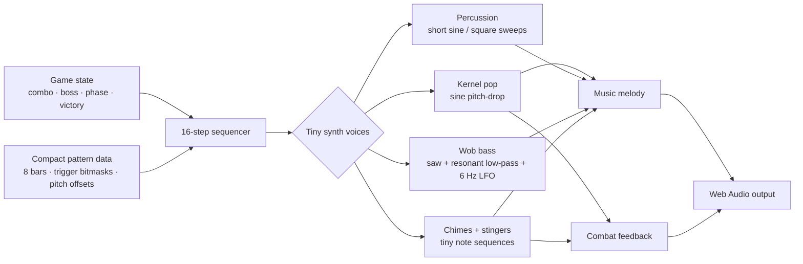

<div align="center">

<a href="docs/stretchicorn-hero.png"></a>

# 🌽🦄 STRETCHICORN

### **STRETCH · SNAP · SHUCK.**

A complete desktop arcade-action game packed into a **13,299 byte js13k ZIP**.

Stretchicorn is a desktop arcade-action game built for js13kGames 2026. You control a unicorn split into two linked parts: a vulnerable body and a safe horn. Pull them apart to charge the rainbow between them, then release that tension as a Rainbow Snap to dash, attack, parry incoming fire, and fight through 13 trials of hostile corn.

Built for **js13kGames 2026 · Unicorns & Rainbows**.

[**Download the standalone HTML**](dist/stretchicorn-local.html) · [**Download the js13k submission ZIP**](dist/stretchicorn-js13k.zip) · [**Read the release process**](RELEASING.md)

**v0.39.0 submission candidate · 13 trials · 5 regular enemy archetypes · 3 authored bosses · 4 difficulties · Impossible Encore · 13,299 / 13,312 bytes**

</div>

---

# Why Stretchicorn plays differently

Stretchicorn is one creature with two independently useful control points:

<div align="center">

</div>

- the **heart-body** is vulnerable and moves with **WASD**,
- the **head/horn** is safe and aims with **Mouse** or **Arrow Keys**,
- the **rainbow between them** behaves like a spring, weapon, dash line and spatial resource,
- **Click** or **Space** releases stored tension as a Rainbow Snap.

There is no separate dash button, parry button, grapple button or special-move wheel. Most of the game's depth comes from deciding where the vulnerable body should be, where the safe horn should point, and what line the rainbow should draw through the arena.

> **Protect the body. Throw the horn into danger. Make the rainbow do several jobs at once.**

## 🌈 Stretch

Move the body away from the horn direction. Separation creates rainbow tension and charges the spring.

A longer stretch gives the next attack more potential, but also makes the body/horn geometry harder to manage.

## 💥 Snap

Release the spring with Click or Space.

A charged Rainbow Snap can be an attack, traversal burst, dodge line, multi-target route, pickup collector, combo extender and setup for the next attack.

## 🌈🌈 Double Rainbow

Recharge and Snap again quickly enough to chain into **Double Rainbow**.

The chained attack hits harder, reaches farther and grants a brief defensive window. Strong play becomes a rhythm of rebuilding tension and redrawing attack lines rather than mashing one attack.

---

# Controls

| Input | Action |
|---|---|
| **W A S D** | Move the vulnerable body / heart |
| **Mouse / Arrow Keys** | Aim the safe horn |
| **Left Click / Space** | Rainbow Snap |
| **1 / 2 / 3 / 4** | Start Easy / Normal / Hard / Impossible |
| **Click difficulty card** | Start that difficulty |
| **Space / Enter on title** | Start Easy |
| **P** | Pause / resume |
| **G** | Open / close the Field Guide |
| **C** | Open Controls from title or pause |
| **M** | Return / back / menu |

Every visible menu action is also clickable. The title, pause screen, Field Guide, Controls, Game Over and result screen use separate boxed actions instead of separator-delimited text. **BACK** returns Field Guide or Controls to the exact screen that opened it, and clicks outside a visible action remain inert.

### Laptop-safe pointer controls

The Controls screen centers the persistent **MOUSE ON/OFF** action above the control legend, with **BACK** centered at the bottom.

When pointer gameplay is OFF, mouse movement cannot disturb horn aim and accidental clicks cannot Snap. Arrow Keys and Space remain authoritative, UI clicks still work, and stale pointer state is cleared before re-enabling. The preference is stored locally.

---

# Gold is opportunity. Cyan is danger.

Projectile color is part of the combat grammar.

### 🟡 Gold kernels

Gold round kernels can be:

- **grazed** near the vulnerable body for charge and **+13 Style outside boss encounters**,
- **parried** with the horn for charge and **+25 Style outside boss encounters**,
- **returned** into enemies and boss shields.

Returned fire rewards precision and distance:

| Return | Meaning |
|---|---|
| **RETURN x2** | close counter |
| **RETURN x3** | medium counter |
| **RETURN x4** | long precision counter |

A dangerous projectile can therefore become charge, Style, defense and offense depending on how the player handles it. During boss encounters, repeatable survival loops stay mechanically useful but become **Style-neutral**: summoned adds, grazes, parries, pickups and wall-smashes cannot be farmed indefinitely. Returned kernels that advance boss state and defeating the boss still score.

### 🔷 Cyan spikes

Cyan spikes deliberately break that conversion loop:

- they cannot be parried,
- they cannot be grazed for value,
- they pierce ordinary dash invulnerability,
- they must be dodged.

Late Hard and Impossible force the player to continuously classify the arena:

**parry gold · dodge cyan · preserve the next Snap line**

---

# The corn army: five reusable combat archetypes

The regular enemies are deliberately small in number. Depth comes from changing **which archetypes coexist, how many are present, what geometry surrounds them, and which projectiles can be converted into offense**.

These are the canonical README names for the five regular combat types:

| Enemy | Behavior | What it asks from the player |
|---|---|---|
| 🌽 **Cornling** | Directly chases the vulnerable body. Low durability, dangerous in groups. | Draw efficient Snap routes through a moving swarm without exposing the heart. |
| 💨 **Stalk Charger** | Stops, telegraphs a direction, then commits to a fast lunge. Crashing into arena geometry damages it and awards a wall-smash bonus. | Read the tell, sidestep the line, or deliberately route the charge into hay. |
| 🟡 **Kernel Spitter** | Tries to maintain firing distance and sends kernels toward the body. | Decide whether each shot should be dodged, grazed, parried or returned. |
| 🌈 **Prismcaster** | Orbits around the player and fires three-shot curved spreads. | Solve changing angular lanes rather than a single straight projectile line. |
| 🛡️ **Husk Brute** | Slow armored pressure. Weak uncharged pokes cannot crack the husk; strong charged attacks do. When defeated, it splits into two Kernel Spitters. | Commit real charge, plan for the second-wave threat, and avoid treating the kill as the end of the problem. |

The archetypes are intentionally complementary. Cornlings compress space. Chargers create temporary forbidden lines. Spitters create return opportunities. Prismcasters bend those projectile lanes. Husks demand commitment and then transform one durable target into two ranged threats.

That means adding an enemy can change the **kind** of problem, not merely the amount of health on screen.

---

# Thirteen Trial Campaign

The campaign is built from recombination rather than thirteen unrelated gimmicks. Normal difficulty provides the cleanest baseline for seeing that structure; Easy reduces pressure, while Hard and Impossible reshape the same encounters through denser rosters and additional rules.

| Trial | Name | Normal-difficulty combat vocabulary | Design purpose |
|---:|---|---|---|
| **1** | **MORNING STRETCH** | 5 Cornlings | Establish body/horn positioning and direct Snap routing. Easy turns this into the five-Snap onboarding sequence. |
| **2** | **KERNEL PANIC** | 6 Cornlings + 1 Stalk Charger | Add a committed dash line to swarm pressure. |
| **3** | **COB MOB** | 6 Cornlings + 2 Chargers + 1 Kernel Spitter | Introduce ranged decisions while the player is still being chased. |
| **4** | **BALE OUT!** | 7 Cornlings + 2 Chargers + 2 Spitters + static hay | Make cover, wall-smashes and route obstruction part of combat. |
| **5** | **HIDEAWAY HUSK** | Boss | Turn patience into offense: the shield opens when Husk commits to firing. |
| **6** | **GOLD RUSH** | 6 Cornlings + 2 Chargers + 2 Spitters + 2 Prismcasters + static hay | Make parry/return play a first-class strategy while curved fire enters the mix. |
| **7** | **CRUNCH TIME** | 6 Cornlings + 2 Chargers + 1 Spitter + 1 Prismcaster + 2 Husk Brutes | Introduce armor and the surprise second wave created when Husks split into shooters. |
| **8** | **HAYWIRE** | 7 Cornlings + 2 Chargers + 2 Spitters + 3 Prismcasters + 2 Husks + tighter static cover | Force threat prioritization inside a crowded angular arena. |
| **9** | **KERNEL COLONEL** | Boss + summoned Spitter/Prismcaster squads + shifting hay | Make returned fire mandatory and combine boss state reading with add management. |
| **10** | **POP QUIZ** | 8 Cornlings + 3 Chargers + 2 Spitters + 3 Prismcasters + 2 Husks | Test the full regular-enemy vocabulary with no single dominant answer. Late Hard/Impossible also introduce cyan classification pressure. |
| **11** | **HAYMAKER** | 9 Cornlings + 3 Chargers + 3 Spitters + 4 Prismcasters + 3 Husks + static cover | Push the largest regular combined-arms formation through constrained routes. |
| **12** | **LAST STRAW** | 8 Cornlings + 4 Chargers + 3 Spitters + 4 Prismcasters + 2 Husks + shifting hay | Final regular-enemy exam: dense mixed pressure while the arena itself changes. |
| **13** | **CAP'N COBTOPUS** | Two-phase boss | Combine movement, return fire, changing cover, opening windows and split-target management. |

This creates a deliberate learning curve:

**single threat → mixed movement → ranged conversion → geometry → armor → full combined arms → authored bosses**

The campaign does not discard earlier knowledge when a new mechanic appears. It keeps old verbs alive and changes their relationships.

### Early campaign: learn the line

Trials 1-4 teach body safety, horn placement, charge, Snap routing, charger tells and basic projectile handling. Static hay then makes the shortest attack line different from the safest one.

### Mid campaign: turn danger into resources

Trials 5-9 introduce boss windows, parries, reflected kernels, curved spreads, armor and splitting threats. The player begins asking not only "How do I avoid this?" but "How can I convert this threat into my next attack?"

### Late campaign: solve moving geometry

Trials 10-12 recombine all five regular archetypes at higher density. On harder modes, cyan spikes remove some of the player's conversion opportunities while hay changes valid routes over time.

### Trial 13: final synthesis

Cap'n Cobtopus asks for nearly every learned verb at once. Phase I alternates shielded states, attacks and changing hay geometry. Destroying the shell produces the announcement:

`CAP'N COBTOPI! • RETURN BOTH`

The fight then becomes two independent shielded cores. Opening and defeating one does not solve the other.

---

# Three bosses, three different questions

The bosses are not normal enemies with larger HP bars. Each changes what "good geometry" means.

| Trial | Boss | Core question |
|---|---|---|
| **5** | **Hideaway Husk** | Can you wait for the firing window and punish commitment? |
| **9** | **Kernel Colonel** | Can you turn incoming fire into the key that opens the boss? |
| **13** | **Cap'n Cobtopus** | Can you combine movement, returns, arena pressure and independent targets? |

## 🌽 Hideaway Husk

Hideaway begins protected by a real shield. Direct attacks do not leak through closed states.

Its offense creates its weakness: an opening tell leads into a firing window where the core becomes vulnerable. As health falls, the cadence becomes less forgiving.

## 🎖 Kernel Colonel

Colonel turns the parry system into encounter structure.

Returned gold kernels are required to open its shield, while the boss also summons alternating Kernel Spitters and Prismcasters. The player has to manage adds, manufacture return angles and capitalize on the temporary opening. Those summons remain dangerous and tactically useful, but killing them does not add Style, combo or Lucky 13 progress, so delaying the Colonel cannot inflate Best Style.

## 🐙 Cap'n Cobtopus

Phase I combines protected/open windows, temporary hay and radial returnable fire. Destroying the shell ruptures it into **Cap'n Cobtopi**, two independently gated cores.

| Difficulty | Returns required per Cobtopi core |
|---|---:|
| Easy | 1 |
| Normal | 2 |
| Hard | 3 |
| Impossible | 4 |

Destroying one core does not finish the fight. Both must be opened and defeated. The live objective follows the phase: **DEFEAT THE COBTOPUS** becomes **DEFEAT THE COBTOPI** the moment the shell splits.

### Anti-pin Phase Shift

Three rapid successful direct boss hits can trigger a deterministic **PHASE SHIFT**.

The damage already earned is preserved, but the boss relocates relative to the vulnerable body and forces the player to construct a fresh attack line. This breaks stationary Snap-loop pinning without arbitrary invulnerability or giant HP inflation.

---

# Four difficulties that alter decisions

Difficulty is not a single health multiplier. The game uses a shared pressure scalar, but different systems consume it differently so each mode changes the player's decision environment.

| System | Easy | Normal | Hard | Impossible |
|---|---:|---:|---:|---:|
| Core pressure scalar | **0.7** | **1.0** | **1.6** | **2.4** |
| Ordinary roster density | reduced | authored baseline | ~1.6× baseline | **capped at Hard density** |
| Hostile attack clocks | slower | baseline | faster | much faster |
| Hostile movement/projectiles | baseline | baseline | baseline | **+25% simulation pressure** |
| Regular enemy HP | baseline | baseline | baseline | **1.5×** |
| Pickups | most generous cadence | baseline | less frequent | **Hard cadence + boss sustain** |
| Late cyan pressure | none | none | introduced after Trial 9 | more frequent |
| Failed run | retry current trial | restart campaign | restart campaign | restart campaign |
| Lucky 13 sustain | heart + shield | heart + shield | heart + shield | **heart + shield** |
| Colonel return gate | 1 | 1 | 2 | 3 |
| Cobtopi return gate | 1/core | 2/core | 3/core | 4/core |
| Final challenge | Trial 13 | Trial 13 | Trial 13 | **Trial 13 + Encore** |

The important design choice is the Impossible roster cap. The full Impossible scalar is **2.4**, but ordinary enemy population deliberately uses the same **1.6 density factor as Hard**.

Why? Because in Stretchicorn, extra enemies are not automatically harder. Skilled players can convert dense swarms into long Snap routes, faster combos and more score. Simply flooding the arena can accidentally hand the player more fuel.

Impossible therefore attacks the player's **conversion engine** instead of only adding bodies.

## 🌱 Easy: teach the real game

Easy is not a detached tutorial build. It uses the production campaign and mechanics with forgiving pressure.

Trial 1, **MORNING STRETCH**, presents five targets one at a time and requires five genuine charged Snap kills. Uncharged chip cannot complete the lesson, and each new target is protected from the same active Snap so one attack cannot accidentally clear multiple tutorial steps.

The sequence teaches:

**pull away → aim → charge → Snap → recharge → repeat**

After the fifth success, the game simply proceeds to Trial 2.

Easy also gives faster pickup opportunities and lets a failed player retry the current trial instead of replaying the whole campaign. The goal is to create enough safety to understand the body/horn relationship without replacing it with simplified physics.

The title and pause menus provide a Field Guide for players who want explicit rules, but the campaign itself remains the primary teacher.

## 🌽 Normal: the authored rhythm

Normal is the reference campaign.

The stage tables, enemy counts and encounter pacing are authored around this mode, making it the cleanest expression of the intended vocabulary curve. Boss return requirements are meaningful without dominating the fight, pickups arrive at the baseline cadence, and a loss restarts the run.

Normal asks the player to graduate from simply clearing arenas to intentionally using graze, parry, return and combo systems.

## 🔥 Hard: denser decisions

Hard increases ordinary encounter density to roughly **1.6×** the Normal stage tables and advances hostile attack clocks faster.

Selected ranged trials gain extra reinforcements, later encounters begin mixing cyan spikes into gold projectile fields, pickups become less frequent, and boss HP/return requirements rise. On Hard and Impossible, passive pickups stop spawning when only one regular enemy remains, so preserving a lone target cannot become a sustain farm.

The central difficulty shift is **classification under crowding**: the player must distinguish returnable opportunity from dodge-only danger while several enemy archetypes compete for space.

Hard is not just Normal with thicker targets. It asks the player to make the same decisions with less spatial and temporal slack.

## ☠️ Impossible: attack the strategy, not just the stats

Impossible keeps ordinary roster density at Hard's level, then changes the rules around that roster:

- the global pressure scalar rises to **2.4**,
- hostile movement/projectile simulation is accelerated,
- regular enemies gain **1.5× HP**,
- projectile classification becomes harsher,
- passive pickup cadence stays at **Hard's rate**, while boss encounters retain survival pickups,
- Lucky 13 restores its **heart + shield** sustain package,
- boss return gates become strictest,
- temporary-bale pressure accelerates,
- and defeating Cap'n Cobtopus unlocks one final **Impossible Encore**.

The result is deliberately hostile to autopilot Snap chaining. More of the arena consists of threats that cannot simply be converted into free offense. The restored sustain is intentional: Impossible still attacks at 2.4 pressure with faster hostile motion, 1.5× regular HP, harsher cyan classification, strict boss gates and Encore, but a strong run now gets enough recovery opportunities to keep learning instead of simply starving out.

### Impossible Encore

Clearing Trial 13 on Impossible is not the end.

The Encore places the three learned boss grammars into one finite arena. Defeated targets stay defeated, stale projectiles are cleared during the transition, and the player must solve the remaining threats in whatever order the fight evolves.

It is the final statement of the campaign's core idea: **master the vocabulary, not a memorized script**.

---

# Style is mastery, not victory

You win by defeating the corn army. **Style** measures how strongly you played while doing it.

The scoring system is deliberately separated into layers so difficulty can be rewarded without making exploits more valuable:

**skill event → anti-farm authority → combo / kill modifiers → raw Style → difficulty finalization → per-difficulty Best**

That order matters. Impossible does not multiply every event as it happens. The game first decides whether an action is legitimate Style at all, builds one raw run score under the same combat rules, and only then applies the Impossible premium when the run terminates.

## What actually earns Style

| Event | Style authority |
|---|---:|
| Regular enemy defeat | **10 base**, then kill bonuses / combo / Gold Cob can modify it |
| Strong charged finish | **+15** kill bonus |
| Highest charged finish | **+35** kill bonus |
| Finish during the active Snap burst | **+10** kill bonus |
| Gold-kernel graze | **+13** outside boss encounters |
| Horn parry | **+25** outside boss encounters |
| Powerup collection | **+15** outside boss encounters |
| Charger wall smash | **+20** outside boss encounters, plus normal defeat Style if the crash is lethal |
| `RETURN x2` | **26** |
| `RETURN x3` | **39** |
| `RETURN x4` | **52** |
| Lucky 13 | **+130** |

Enemy-defeat Style is where the game's larger multipliers live. A kill starts from its base and charge/Snap bonuses, is multiplied by the active **combo (1× → 4×)**, and is doubled while **Gold Cob** is active. This makes a clean routed Snap through a dangerous formation much more valuable than slowly poking isolated targets.

Returns are scored by demonstrated precision rather than difficulty label: x2 / x3 / x4 returns award `2×13`, `3×13`, or `4×13` Style. A lethal return can also earn the appropriate defeat bonus. The same return system is used to make real progress against shielded bosses.

## Why boss farming is score-neutral

A high score should measure **solving encounters**, not discovering which renewable enemy can be milked forever.

Kernel Colonel exposed the important edge case. Its summoned Spitters and Prismcasters are intentionally renewable because they make the fight better, but renewable pressure cannot also be renewable score. During boss encounters:

- summoned adds do **not** add Style,
- summoned adds do **not** advance combo,
- summoned adds do **not** advance Lucky 13,
- repeatable boss-stage grazes, parries, pickups and wall-smashes remain mechanically useful but add **0 Style**,
- returned kernels that actually damage or unlock the boss still score,
- defeating the boss still scores.

The result is a simple principle:

> **Boss adds are pressure, not currency.**

Hard and Impossible apply the same philosophy to sustain farming. Once an ordinary wave is reduced to one remaining enemy, new passive pickups stop spawning. Existing pickups are preserved and boss encounters retain survival pickups, so the rule blocks intentional stalling without deleting legitimate resources.

## Difficulty-aware finalization

Each difficulty stores its own Best because the modes create different scoring opportunities and different survival costs.

| Difficulty | Raw Style during the run | Run-end finalization | Persistent Best bucket |
|---|---:|---:|---|
| Easy | normal scoring | **1×** | Easy |
| Normal | normal scoring | **1×** | Normal |
| Hard | normal scoring | **1×** | Hard |
| Impossible | normal scoring | **3× at run end** | Impossible |

Hard deliberately keeps its existing score scale. Its denser formations can produce longer Snap routes and more combo opportunities, so blindly multiplying Hard merely because it is harder would also multiply the extra scoring fuel created by density.

Impossible is different. Ordinary population is capped at Hard density, while the mode adds a **2.4× hostile clock, +25% hostile simulation pressure, 1.5× regular HP, harsher cyan classification, strict return gates, campaign-reset stakes and Encore**. Those rules dramatically reduce how many safe scoring opportunities survive a run. The mode therefore receives its premium at the *finalization layer*, after legitimate raw Style has already been established.

This was calibrated against actual play rather than chosen in isolation. Before the premium, strong Hard runs could finish around **120,000 Style** while meaningful Impossible attempts could compress toward roughly **30,000 raw Style** because so much more of the run is spent surviving rather than harvesting scoring opportunities. A 3× finalization narrows that mismatch without guaranteeing that selecting Impossible automatically beats a strong Hard performance.

A concrete playtest example makes the contract visible:

- **Hard:** 120,000 raw → **120,000 final**
- **Impossible:** 40,010 raw → **120,030 final**

The second score is not manufactured during combat. The 40,010 points still had to be earned under Impossible's harsher rules; the game recognizes the difficulty only when the run is over.

## Why the multiplier cannot resurrect exploits

The most important ordering invariant is:

**invalid / renewable boss Style becomes zero before Impossible finalization.**

If a Colonel summon is worth zero raw Style, Impossible computes `0 × 3 = 0`. The same is true for boss-stage graze, parry, pickup and wall-smash loops. Opening Controls also cannot trigger or stack the premium. The finalization step only runs when an Impossible run actually terminates and then persists the result to the Impossible-specific Best slot.

That keeps the score interpretable:

- **Victory** asks whether you defeated the corn army.
- **Raw Style** measures the quality of the actions you successfully converted into offense.
- **Difficulty finalization** recognizes the environment those actions survived.
- **Best** compares the run only with prior runs from the same difficulty.
- **Time + hearts** remain visible context for pace and survivability rather than being silently folded into Style.

The victory sequence keeps Stretchicorn in the final gameplay pose while the defeated Cap'n Cobtopus erupts into **rainbow popcorn**, followed by Style, Best, time and hearts.

---

# Powerups and Lucky 13

Five compact pickups reuse the game's existing corn/shape vocabulary:

| Pickup | Effect |
|---|---|
| **♥ Heart Kernel** | restore one heart, capped at 13 |
| **Husk Shield** | absorb the next ordinary body hit |
| **Butter Boost** | temporary movement speed |
| **Prism Cob Power** | seeds charge and lowers the practical charged-Snap threshold |
| **Gold Cob** | 2× enemy-defeat Style for six seconds |

Every 13th kill triggers **Lucky 13**:

- +130 Style,
- immediate charge / ready state,
- radial rainbow feedback,
- an extra heart and shield on **all four difficulties**.

The number 13 is therefore both competition theme and gameplay rhythm.

---

# Hay that changes the arena

Hay is not decorative scenery. Static and temporary straw geometry changes valid movement, projectile and Snap routes.

Temporary bales move through three readable states:

1. **forming**: translucent warning geometry and progress cue,
2. **solid**: real collision for player, enemies and projectiles,
3. **gone**: the route reopens.

If a bale hardens over the vulnerable body, the game ejects the body and applies the appropriate hit instead of trapping the player in geometry. Enemy overlap is resolved too.

Depending on the encounter, the same bale can be cover, danger, a route blocker, a projectile blocker or a wall-smash opportunity.

---

# The sky is a progress meter

The background is not a stack of imported level images.

Progress restores a shared nested-rainbow system:

### 🌈 Early: single rainbow
One broad six-band arch appears.

### 🌈🌈 Mid: double rainbow
A second arch forms inside it.

### 🌈🌈🌈 Late: triple rainbow
A third nested arch completes the restored sky.

All use natural radial order: **red outside, violet inside**. The title uses the same visual family, so menu, campaign and ending share one motif.

---

# What fits in 13 KB?

Stretchicorn is not a tech demo wrapped around one mechanic. The competition build contains:

| System | Included |
|---|---|
| **Campaign** | 13 authored trials with escalating enemy combinations and arena rules |
| **Core movement** | independent vulnerable-body movement + safe horn aiming |
| **Combat** | charge, Rainbow Snap, Double Rainbow, graze, parry, returns, wall smashes |
| **Enemies** | 5 regular archetypes with complementary movement/attack roles |
| **Bosses** | Hideaway Husk, Kernel Colonel, two-phase Cap'n Cobtopus |
| **Expert finale** | Impossible Encore recombining learned boss counterplay |
| **Difficulty** | four modes with density, timing, projectile, sustain, gate and retry differences |
| **Arena** | static cover + temporary hay that warns, hardens, collides and disappears |
| **Powerups** | Heart, Husk Shield, Butter Boost, Prism power, Gold 2X, Lucky 13 |
| **Scoring** | Style, combo multiplier, precision returns, per-difficulty Best, Impossible 3× run-end premium |
| **Visuals** | fully procedural characters, corn, bosses, VFX, hay, terrain, UI and rainbow sky |
| **Audio** | procedural Web Audio music, bass, percussion, chimes and combat feedback |
| **Persistence** | per-difficulty Best + pointer preference through guarded localStorage |
| **Reliability** | deterministic packaging, VM regressions, offline checks, Chromium/Firefox/WebKit smoke |
| **External runtime assets** | **0** |

The shipping ZIP uses **99.910% of the 13,312 byte limit**. There are **13 bytes free**.

---

# Everything in the game is generated at runtime

The competition archive contains:

- no sprite sheets,
- no raster game art,
- no audio files,
- no web fonts,
- no CDN dependencies,
- no fetch/XHR/WebSocket runtime,
- no external resources.

Characters and environments are assembled from Canvas primitives. The same shapes repeatedly change jobs:

- ellipses become bodies, kernels, eyes, highlights and medals,
- arcs become shields, telegraphs and rainbow skies,
- curves become husks, tentacles, mane, tail and terrain,
- the six-color palette becomes character detail, combat feedback and world restoration,
- one corn rendering grammar scales from Cornlings to authored bosses.

That reuse compresses well, but it also makes the world visually coherent.

---

# Procedural audio: the corn has a synthesizer

There are **no samples, prerecorded tracks or audio assets** in the competition archive. Stretchicorn synthesizes its music and sound effects at runtime with a tiny Web Audio instrument, then uses game state as part of the arrangement.

The result is closer to a miniature reactive tracker than a conventional soundtrack file.



## One tiny synth, several jobs

The audio system is built from a few reusable synthesis primitives instead of separate instruments and sound files.

| Building block | How it is synthesized | Jobs it performs |
|---|---|---|
| **`snd()` oscillator event** | Creates a sine, square, triangle or saw oscillator, optionally glides its pitch, and applies a fast exponential gain decay. | Kick-like hits, bright ticks, low boss pulses, Snap/hit feedback and the raw material for the other voices. |
| **`kp()` kernel pop** | Starts a sine oscillator at **1.75×** the target frequency and rapidly drops into the target pitch. | The game's signature popping-corn timbre, used both as a melodic note and as feedback for kills, parries and shield interactions. |
| **`wob()` bass voice** | Sends a saw oscillator through a resonant **210 Hz low-pass filter** whose cutoff is modulated by a **6 Hz LFO**. | Compact dubstep-flavored bass punctuation and the heavier Impossible Encore texture. |
| **`duo()` / `chime()` micro-sequences** | Schedules two-note stingers or an ascending three-note **660 → 880 → 1100 Hz** chime. | Trial transitions, confirmation cues and victory without storing a jingle. |

The generic oscillator is intentionally plain. Character comes from **pitch motion, envelope shape, sequencing and context**, which are much cheaper than shipping sampled instruments.

## An eight-bar arcade/EDM sequencer

The normal soundtrack runs on **16-step bars**. Rather than storing note events as large arrays or MIDI-like objects, rhythmic trigger maps are compressed into integer bitmasks. A bit being on means "play an event on this step." Melody is encoded as a short repeating sequence of pitch offsets and a slowly changing root frequency.

The eight bars deliberately change energy instead of looping one identical beat:

| Bar | Base tempo | Musical role |
|---:|---:|---|
| **1** | 168 BPM | Establish the kernel-pop hook and forward arcade pulse. |
| **2** | 174 BPM | Continue the climb with a slightly denser rising feel. |
| **3** | 178 BPM | Push into a busier, brighter section. |
| **4** | 150 BPM | Drop into a sparse half-time/trap-like pocket with short hat activity. |
| **5** | 162 BPM | Reset into a more open melodic pattern. |
| **6** | 184 BPM | Hit the fastest peak, with the melodic line lifted an octave. |
| **7** | 176 BPM | Sustain the high-energy drive. |
| **8** | 154 BPM | Return to a half-time release before the cycle turns over. |

Across the longer phrase, the melodic root also rotates through **220, 196, 176 and 165 Hz**. The soundtrack therefore gets structural movement from a handful of numbers rather than from a stored waveform.

## Gameplay is part of the arrangement

The sequencer is not isolated from play. Stretchicorn feeds combat state back into the music, so the same compact pattern can feel different as the run changes.

| Game state | Audio response |
|---|---|
| **Combo rises** | Tempo increases by up to roughly **+9 BPM** at a 4× combo. Above 2× combo, extra high-frequency pulses appear on alternating steps. |
| **Hideaway Husk** | Low triangle accents enter underneath the regular sequence, giving Trial 5 a heavier pulse without loading another track. |
| **Kernel Colonel** | Repeating bright square-wave accents cut through the mix while the return-fire boss grammar is active. |
| **Cap'n Cobtopus** | Deep sine pulses reinforce the final-boss weight while the shared main sequence continues. |
| **Impossible Encore** | The normal eight-bar cycle is replaced by a dedicated sparse **110 BPM** pattern with low pitch drops, wob bass and rapid high ticks. |
| **Victory** | The same synthesis layer resolves into the short ascending three-note chime. |

This means the music can react to mastery without a stem mixer, adaptive-audio middleware or multiple audio files. **The game state itself becomes an arrangement control signal.**

## The kernel pop belongs to both the soundtrack and the fight

The most important reuse is the kernel-pop voice.

In the sequencer it carries much of the melody. During combat, related pitched pops acknowledge kills, parries and shield events. The player therefore hears the same sonic object in two roles:

**corn as enemy → corn as impact → corn as percussion → corn as melody**

That was partly a compression decision, but it became an art-direction decision too. Music and sound effects do not feel like two asset packs laid on top of one another because they are literally synthesized from the same tiny vocabulary.

## Why this approach fits Stretchicorn

The audio system follows the same philosophy as the rest of the game:

- **recombination instead of accumulation**: a few oscillator voices become percussion, melody, bass, boss color and feedback,
- **state instead of stored media**: patterns and gameplay variables describe what to synthesize rather than storing the resulting sound,
- **mechanics and presentation share vocabulary**: the kernel that pops on screen also conceptually "pops" in the music,
- **fully offline**: the browser creates every sound after the player's first interaction; there are no audio downloads,
- **browser-safe startup**: the AudioContext is created/resumed from player input so modern autoplay policies do not leave the soundtrack silently suspended.

The same constraint that removed audio files also produced a more unified soundtrack: **the corn army is effectively playing its own synthesizer.**

---

# Why the 13 KB constraint improved the design

### One mechanic, many verbs

The body/horn/rainbow relationship produces movement, aiming, charging, dashing, attacking, dodging, grazing, parrying, traversal and routing without buying a separate subsystem for every verb.

### Recombination beats accumulation

Five regular enemy archetypes, three bosses, gold/cyan projectiles, hay states and four difficulty rules can be recombined into many different spatial problems. This increases depth faster than it increases code.

### Shape reuse becomes art direction

The same primitives that make the ZIP smaller also make the world feel related. Corn enemies and bosses look like one family because they literally share a rendering grammar.

### Deletion is a feature

Across development, weaker ideas were removed instead of endlessly preserved: duplicate intro states, redundant world renderers, obsolete boss grammars, old grading language and several one-off visual systems.

The question behind every byte became:

> **Does this make the game more legible, more replayable or more fun?**

---

# 13,301 bytes, deterministically

The current competition artifact is:

```text
dist/stretchicorn-js13k.zip
dist/stretchicorn-desktop-v0.39.0.zip
13,299 / 13,312 bytes
13 bytes free
SHA-256 d16b1ed524a9e4df36933b3c03e61cd91dc3186cb5955be938e2bbf1b7d00ac7
```

The stable and versioned ZIPs are byte-identical and contain exactly one file at archive root:

```text
index.html
```

The final `dist/stretchicorn-local.html` is also byte-identical to that packed `index.html`, so direct `file://` qualification and exact-ZIP qualification exercise the same game payload through two browser launch paths.

The production path is:

```text
readable source modules
        ↓
competition-only source slicing / override composition
        ↓
safe identifier golf
        ↓
Terser 5.50.0
        ↓
Roadroller 2.1.0 with pinned deterministic model
        ↓
Zopfli 0.4.3 deterministic ZIP
        ↓
one root-level index.html
```

Roadroller is run twice and the outputs must match before packaging continues.

---

# Release confidence

Extreme byte golf makes regressions unusually easy to introduce, so the repository treats the final ZIP as a reproducible artifact and tests both readable behavior and transformed output.

The canonical `npm run release:competition` path covers:

- legacy settings migration and persistent pointer preference,
- pointer OFF authority while preserving Arrow + Space,
- independently centered title actions with no separator dot,
- boxed title/pause/Guide/Controls/Game Over/result click authority,
- **G** Field Guide shortcut plus exact return-to-origin behavior,
- explicit Controls mouse toggle and inert empty-space clicks,
- deterministic multi-difficulty/boss soak with finite-state and entity-count bounds,
- Easy Morning Stretch progression,
- the complete 13-trial naming contract,
- exact `CAP'N COBTOPI! • RETURN BOTH` runtime transition,
- Field Guide, pause and retry/reset contracts,
- per-difficulty Best persistence and storage failure fallback,
- reflected-projectile single-resolution authority,
- boss shield/open-window authority,
- Hideaway firing vulnerability,
- Colonel return gate,
- Cap'n Cobtopus two-phase / independent-core behavior,
- difficulty-scaled return requirements,
- precision `RETURN x2/x3/x4`,
- anti-pin Phase Shift,
- late-Hard / Impossible cyan pressure,
- Impossible Encore defeat-order completion,
- safe spawn invariants,
- deterministic single → double → triple rainbow progression,
- no external runtime references or network-capable APIs,
- deterministic archive metadata/content,
- exact 13,312-byte ceiling,
- release metadata and `dist/` hygiene,
- committed `dist/` parity with rebuilt source,
- exact submitted ZIP in Chromium, Firefox and WebKit,
- byte-identical standalone `file://` payload in Chromium, Firefox and WebKit.

The final release path is intentionally boring. That is a compliment.

---

# Repository map

```text
src/                      readable source modules
scripts/
  run-regressions.mjs    current VM regression manifest
  audit-release.mjs      release metadata + dist hygiene contract
  build.mjs              source composition + readable regression builder
  pack-competition.mjs   deterministic packer + exact local-payload writer
  package.py             deterministic Zopfli ZIP writer
  test-v044.mjs          storage/input + multi-difficulty soak audit
  test-v043.mjs          boxed menu click authority + pointer input
  test-v042.mjs          rainbow-popcorn finale + Style semantics
  test-v041.mjs          Easy Morning Stretch built-artifact tutorial
  test-v040.mjs          Field Guide back + mouse + hay regressions
  test-v039.mjs          collision/pause/G-Guide/retry/Encore authority
  browser-smoke.mjs      exact submitted ZIP + boxed-menu browser smoke
  file-smoke.mjs         byte-identical direct file:// browser smoke
dist/
  index.html
  stretchicorn-local.html
  stretchicorn-js13k.zip
  stretchicorn-desktop-v0.39.0.zip
docs/
  stretchicorn-hero.png
  stretchicorn-controls.svg
  release-v039.md
```

Historical release artifacts live in Git history rather than cluttering the current working tree.

---

# Build it

Requirements:

- Node.js 22+
- Python 3.12+
- `zopfli==0.4.3`

```bash
npm run release:competition
```

That command rebuilds the game, runs the active VM regression manifest, packs the competition HTML, verifies offline behavior, creates deterministic ZIPs, audits release metadata and `dist/` hygiene, verifies archive identity and checks the hard byte ceiling.

For direct local play, open:

```text
dist/stretchicorn-local.html
```

See [`PLAY_LOCAL.md`](PLAY_LOCAL.md) and [`RELEASING.md`](RELEASING.md) for the complete paths.

---

# Design principle

> **Make every byte do more than one job.**

Stretchicorn's rainbow is a weapon, movement system, dodge route, charge meter and compositional spine. Its corn kernels are enemies, projectiles, pickups, boss motifs and musical percussion. Its background is scenery and progression. Its difficulty modes are balance settings and different mastery tests.

That is the game.
