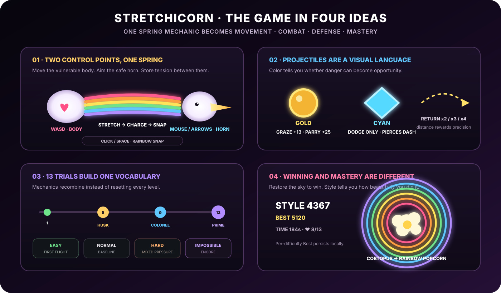
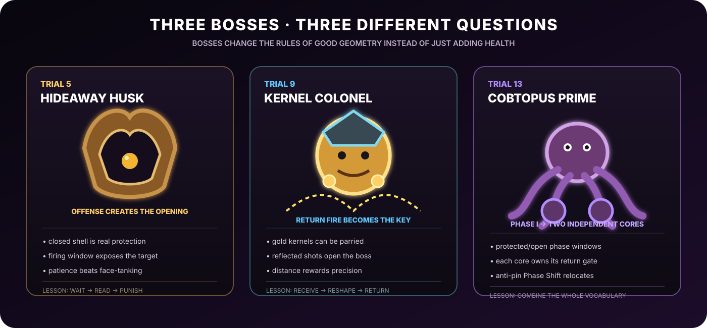

<div align="center">

<a href="docs/stretchicorn-hero.png"></a>

# 🌽🦄 STRETCHICORN

### **STRETCH · SNAP · SHUCK.**

**A complete desktop arcade-action game packed into a 13,310 byte js13k ZIP.**

Move the vulnerable body. Aim the safe horn. Stretch the rainbow. Release it as a weapon.

Built for **js13kGames 2026 · Unicorns & Rainbows**.

[**Play the standalone build**](dist/stretchicorn-local.html) · [**Download the 13 KB submission**](dist/stretchicorn-js13k.zip) · [**Release engineering**](RELEASING.md) · [**Play locally**](PLAY_LOCAL.md)

**13 trials · 4 difficulties · 3 authored bosses · Impossible Encore · 0 external runtime assets · 13,310 / 13,312 bytes**

</div>

---

## The pitch

Stretchicorn is built around one unusual spatial rule: **the body and horn are controlled independently, while the rainbow between them behaves like a spring**.

That one relationship powers movement, charging, dashing, attacking, dodging, grazing, parrying, pickup routing, boss counterplay and high-score play. Instead of buying a separate button and subsystem for every verb, the game asks the player to draw a better line through danger.

<div align="center">

</div>

### Why this project is interesting

| Idea | What Stretchicorn does |
|---|---|
| **Mechanic compression** | One body/horn/rainbow geometry becomes movement, weapon, defense and routing system. |
| **Readable combat language** | Gold projectiles are opportunities to graze/parry/return; cyan projectiles are dodge-only threats. |
| **Bosses as rule changes** | Hideaway Husk, Kernel Colonel and Cobtopus Prime each require a different learned counterplay grammar. |
| **Constraint-driven art direction** | Canvas primitives are reused across characters, corn, bosses, hay, UI, VFX and the restoring rainbow sky. |
| **Meaningful replay loop** | Winning restores the sky; **Style** measures mastery; per-difficulty Best persists locally. |
| **Shipping discipline** | Deterministic packaging, exact artifact parity, VM regressions and Chromium/Firefox smoke tests defend a 99.985%-full ZIP. |

---

# One creature, two control points, one spring

<div align="center">

</div>

- **WASD** moves the vulnerable heart-body.
- **Mouse / Arrow Keys** aim the safe horn.
- Pulling the two points apart stores rainbow tension.
- **Click / Space** releases that tension as a **Rainbow Snap**.
- Recharge and Snap again quickly to chain a stronger **Double Rainbow**.

The horn and rainbow can be thrown into danger. The body cannot. Good play is therefore less about steering a single avatar and more about managing the geometry between two points.

### Controls

| Input | Action |
|---|---|
| **W A S D** | Move the vulnerable body / heart |
| **Mouse / Arrow Keys** | Aim the horn |
| **Left Click / Space** | Rainbow Snap |
| **1 / 2 / 3 / 4** | Start Easy / Normal / Hard / Impossible |
| **P** | Pause / resume |
| **F while paused** | Open the Field Guide |
| **C** | Open Controls from title or pause |
| **M** | Back / menu |

### Laptop-safe pointer mode

The Controls screen includes a persistent **MOUSE - ON / OFF** toggle. Turning mouse gameplay OFF prevents touchpad movement from stealing horn aim and blocks accidental click-to-Snap, while **Arrow Keys + Space remain active**. Menu clicks still work so the option can always be turned back on.

---

# Combat is a color language

Stretchicorn deliberately makes projectiles mean different things instead of treating every bullet as the same hazard.

### 🟡 Gold kernels: danger you can convert

Gold kernels can be:

- **grazed** near the vulnerable body for **+13 Style** and charge,
- **parried** with the horn for **+25 Style** and charge,
- **returned** into enemies and boss shields.

Longer reflected shots earn stronger precision returns: **RETURN x2 / x3 / x4**.

### 🔷 Cyan spikes: danger you must respect

Cyan spikes:

- cannot be parried,
- cannot be grazed for value,
- pierce ordinary dash invulnerability,
- must be dodged.

Late Hard and Impossible therefore become a rapid classification problem:

> **parry gold · dodge cyan · preserve the next Snap line**

### Hay changes the geometry

Temporary procedural hay bales warn, harden into real collision/cover, then disappear. They can become shelter, route blockers, hazards or wall-smash opportunities depending on the current encounter.

---

# Thirteen trials teach one growing vocabulary

The campaign is designed around **recombination**, not thirteen unrelated gimmicks.

| Phase | What changes |
|---|---|
| **Early** | movement, tension and direct Snap routing |
| **Mid** | ranged kernels, parries, armor, static cover and denser formations |
| **Late** | curved spreads, temporary hay, mixed gold/cyan pressure and tighter positioning |
| **Trial 13** | nearly every learned verb is recombined inside Cobtopus Prime |

Easy Trial 1 is **FIRST FLIGHT**: five real charged Snap kills, one target at a time, using the same production movement and combat rules as the rest of the game. There is no detached tutorial physics mode to learn and then discard.

The title and pause menus also expose a compact **Field Guide** covering the win condition, body/horn safety, charge + Snap, Double Rainbow, projectile language, Style, powerups, Lucky 13, hay, enemies, bosses and Impossible Encore.

---

# Three bosses, three different questions

<div align="center">

</div>

The bosses are not normal enemies with larger health bars.

| Trial | Boss | Core question |
|---|---|---|
| **5** | **Hideaway Husk** | Can you wait for the firing window and punish it? |
| **9** | **Kernel Colonel** | Can you reshape incoming fire into the key that opens the boss? |
| **13** | **Cobtopus Prime** | Can you combine movement, returns, arena pressure and split targets? |

**Hideaway Husk** closes behind a real shield, then exposes itself while firing. Its offense creates the punish window.

**Kernel Colonel** weaponizes the parry system. Reflected gold kernels are part of the shield-opening grammar, not merely bonus damage.

**Cobtopus Prime** moves from protected/open Phase I windows into **two independent cores**, each with its own reflected-kernel gate. Three rapid successful hits can trigger a deterministic anti-pin **PHASE SHIFT**, preserving earned damage while forcing the player to construct a new attack line.

On **Impossible**, the campaign continues into a finite **Encore** that recombines learned boss logic under expert anti-chain pressure.

---

# Four difficulties change decisions, not only numbers

| Mode | Design intent |
|---|---|
| **Easy** | First Flight onboarding, forgiving pressure, retry failed trial |
| **Normal** | intended campaign rhythm |
| **Hard** | denser late encounters and stronger gold/cyan classification pressure |
| **Impossible** | expert anti-chain pressure, reduced sustain, stricter boss gates, Encore |

A useful playtest discovery shaped the hardest mode: **adding more enemies can make Stretchicorn easier for skilled players**, because extra bodies become extra combo targets. Impossible therefore attacks the player's conversion engine instead of simply flooding the arena with more fodder.

---

# Style is mastery, not victory

You win by clearing all 13 trials and restoring the sky. **Style** answers a different question: *how boldly and skillfully did you do it?*

Style rewards charged Snaps, chained kills, grazes, parries, long returns, wall-smash opportunities, Lucky 13 routing and maintaining aggressive flow. The combo multiplier climbs toward **4×** while pressure stays high.

The end of a run reports:

- **STYLE**: mastery during this run,
- **BEST**: persistent personal best for the selected difficulty,
- **TIME**: completion speed,
- **♥ remaining**: survival quality.

Once a score has been recorded, the title screen also shows the highest saved **BEST STYLE** across the four difficulty-specific records. Persistence uses guarded browser `localStorage`; there is no account or network dependency.

The victory sequence keeps Stretchicorn intact in its final gameplay pose while the defeated Cobtopus becomes the focal point and bursts into **rainbow popcorn**.

---

# The visual system is generated, not imported

The competition build has **zero external runtime assets**:

- no sprite sheets,
- no raster gameplay art,
- no audio files,
- no web fonts,
- no CDN dependencies,
- no fetch/XHR/WebSocket runtime,
- no external resources.

Everything is assembled at runtime from Canvas and Web Audio primitives.

### Procedural visual language

The same small set of shapes repeatedly changes jobs:

| Primitive / motif | Reused as |
|---|---|
| **Ellipses** | bodies, kernels, eyes, highlights, medals, pickup forms |
| **Arcs** | shields, telegraphs, boss rings, nested rainbow sky |
| **Curves** | husks, tentacles, mane, tail, terrain silhouettes |
| **Six-color palette** | Stretchicorn, combat feedback, world restoration, finale VFX |
| **Corn grammar** | swarm enemies, ranged threats, pickups, boss identity, audio motifs |
| **Rainbow geometry** | character connection, charge feedback, attack line, progression, title motif |

That reuse is not only compression. It is the art direction: enemies and bosses feel related because they literally share a drawing grammar.

### The sky doubles as progression

Campaign progress restores a nested rainbow family:

- early game: **single rainbow**,
- mid game: **double rainbow**,
- late game: **triple rainbow**.

The title screen, gameplay and ending all reuse that same visual family, giving the project one coherent motif instead of paying for disconnected menu and level art systems.

### Procedural audio

A small Web Audio voice set generates rhythmic hits, pitched kernel pops, melodic hooks, bass/wobble accents, combat feedback, boss coloration and victory sounds. Music and combat intentionally share voices so the soundtrack feels built from the same corn-filled world.

---

# What actually fits in 13 KB?

| System | Included in the shipping competition build |
|---|---|
| **Campaign** | 13 authored trials with escalating enemy mixes and arena rules |
| **Core mechanic** | independent body movement + safe horn aiming + spring tension |
| **Combat** | Rainbow Snap, Double Rainbow, graze, parry, returns, wall smashes |
| **Bosses** | Hideaway Husk, Kernel Colonel, two-phase Cobtopus Prime |
| **Expert finale** | Impossible Encore |
| **Difficulty** | Easy, Normal, Hard, Impossible with mechanical differences |
| **Enemies** | chase swarms, dashers, ranged shooters, prisms, armored husks |
| **Projectiles** | gold parry/graze kernels + cyan dodge-only piercing spikes |
| **Arena** | static cover + temporary hay barriers |
| **Powerups** | Heart, Husk Shield, Butter Boost, Prism, Gold 2X, Lucky 13 |
| **Scoring** | Style, combo multiplier, precision return tiers, per-difficulty Best |
| **Onboarding** | First Flight + Field Guide |
| **Usability** | pause/retry flow + persistent laptop-safe mouse toggle |
| **Visuals** | procedural characters, bosses, VFX, hay, UI, terrain and rainbow sky |
| **Audio** | procedural Web Audio music and feedback |
| **Persistence** | local Best Style + pointer preference |
| **Reliability** | deterministic packaging + regression/browser validation |
| **External runtime assets** | **0** |

The current shipping archive uses **99.985%** of the js13k limit:

```text
dist/stretchicorn-js13k.zip
dist/stretchicorn-desktop-v0.39.0.zip
13,310 / 13,312 bytes
2 bytes free
SHA-256 ff8dc4532a654407be15d4b8f14f4c0a695b9cc712e13be56882c1347dd66912
```

---

# 13 KB is part of the architecture

<div align="center">

</div>

The byte ceiling was treated as a design constraint, not a last-minute packaging problem.

### One mechanic, many verbs

The body/horn/rainbow relationship produces multiple player actions without paying for separate movement, dash, parry, grapple and special-attack systems.

### Recombination beats accumulation

Bosses, late trials and difficulty modes mostly recombine rules the player already knows. Depth grows faster than code size.

### Deletion is a feature

Development repeatedly removed weaker or duplicate ideas instead of preserving every experiment: redundant intro states, obsolete boss grammars, extra visual systems and configuration surfaces all lost their bytes when they stopped carrying enough game value.

### Deterministic release pipeline

```text
readable source modules
        ↓
competition composition / source slicing
        ↓
safe identifier golf
        ↓
Terser 5.50.0
        ↓
Roadroller 2.1.0 with pinned deterministic model
        ↓
Zopfli 0.4.3 deterministic ZIP
        ↓
one root-level index.html
```

Roadroller is run twice and must produce identical output before packaging continues. The stable and versioned ZIPs are byte-identical.

---

# Release confidence

Extreme byte golf makes tiny edits capable of creating surprisingly large behavioral or compression changes, so the repository treats the final ZIP as a reproducible release artifact rather than a hand-built bundle.

The canonical release path validates, among other things:

- mouse OFF/ON input authority and stale-pointer suppression,
- Controls and Field Guide round trips from title/pause,
- Easy First Flight progression,
- pause/retry semantics,
- per-difficulty Best persistence and storage fallback,
- reflected-projectile single-resolution authority,
- boss shield/open-state contracts,
- Prime split-core and Phase Shift behavior,
- difficulty-scaled boss return gates,
- RETURN x2/x3/x4 precision scoring,
- late-Hard / Impossible cyan pressure,
- all Impossible Encore completion orders,
- safe spawning and finite-state/entity-count soak bounds,
- deterministic single → double → triple rainbow progression,
- no external runtime references or network-capable APIs,
- deterministic archive content/metadata,
- exact 13,312-byte ceiling,
- committed `dist/` parity with a clean rebuild,
- exact submitted ZIP in **Chromium and Firefox**,
- standalone `file://` playtest in **Chromium and Firefox**.

The release path is intentionally boring. For a 13 KB game balanced on two spare bytes, boring deployment is beautiful.

---

# Build and play

Requirements:

- Node.js 22+
- Python 3.12+
- `zopfli==0.4.3`

Build, test, pack and audit the competition release:

```bash
npm run release:competition
```

Run the standalone build locally:

```bash
npm run play:local
```

or open:

```text
dist/stretchicorn-local.html
```

See [`PLAY_LOCAL.md`](PLAY_LOCAL.md) and [`RELEASING.md`](RELEASING.md) for the complete workflows.

---

# Repository map

```text
src/                       readable gameplay / rendering / UI modules
scripts/
  run-regressions.mjs     canonical VM regression manifest
  audit-release.mjs       release metadata + dist hygiene contract
  build.mjs               source composition + standalone builder
  pack-competition.mjs    deterministic Terser + Roadroller packer
  package.py              deterministic Zopfli ZIP writer
  test-v044.mjs           final storage/input + difficulty/boss soak audit
  test-v043.mjs           pointer-input + title Best Style authority
  test-v042.mjs           rainbow-popcorn finale + Style semantics
  test-v041.mjs           Easy First Flight tutorial contract
  test-v040.mjs           Field Guide + mouse + hay regressions
  test-v039.mjs           collision/pause/retry/Encore authority
  browser-smoke.mjs       exact submitted ZIP browser smoke
  file-smoke.mjs          direct standalone file:// smoke
dist/
  index.html
  stretchicorn-local.html
  stretchicorn-js13k.zip
  stretchicorn-desktop-v0.39.0.zip
docs/
  stretchicorn-hero.png
  stretchicorn-showcase.svg
  stretchicorn-controls.svg
  stretchicorn-boss-grammar.svg
  stretchicorn-13k-architecture.svg
```

Historical binary candidates live in Git history rather than cluttering the current shipping tree.

---

# Design notes

The repository keeps the deeper design and release history available without forcing the README to become a development diary:

- [`docs/design-review-v039.md`](docs/design-review-v039.md) — final design review
- [`docs/difficulty-modes.md`](docs/difficulty-modes.md) — difficulty philosophy and mechanics
- [`docs/release-v039.md`](docs/release-v039.md) — current qualified release notes
- [`docs/heavy-drop-boss-theatre-v0.22.md`](docs/heavy-drop-boss-theatre-v0.22.md) — boss presentation exploration
- [`docs/rainbow-theatre-v0.22.md`](docs/rainbow-theatre-v0.22.md) — rainbow/world visual development
- [`CHANGELOG.md`](CHANGELOG.md) — implementation history

---

# Design principle

> ## **Make every byte do more than one job.**

Stretchicorn's rainbow is a weapon, movement system, dodge route, charge meter and compositional spine. Corn kernels are enemies, projectiles, pickups, boss motifs and percussion. The sky is scenery and progression. Difficulty modes are balance settings and different mastery tests.

**That is the game, and that is the compression strategy.**
