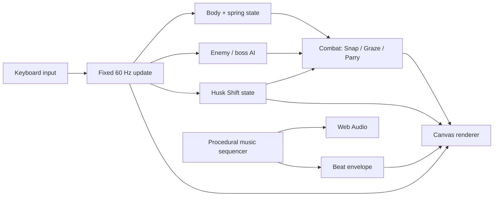

<div align="center">

<a href="docs/stretchicorn-hero.png"></a>

# 🌽🦄 STRETCHICORN

### **STRETCH · SNAP · SHUCK.**

**A tiny desktop action game where you play as an enchanted unicorn gifted the power to rainbow-stretch and fight off an army of angry corn across 13 chaotic trials!**

Built for **js13kGames 2026 · Unicorns & Rainbows**.

[**Download the current v0.20.7 competition ZIP**](dist/stretchicorn-desktop-v0.20.7.zip)

**13 hearts · 13 trials · way too much corn**

</div>

---

## What is Stretchicorn?

Stretchicorn is a fast arcade-action game built around one strange control idea: **the unicorn is controlled from both ends**.

You move the vulnerable body with one hand, steer the safe head and horn with the other, then pull the two apart to charge the rainbow stretched between them.

```text
PULL ←     ♥ BODY ═══════ 🌈 RAINBOW ═══════ 🦄 HEAD / HORN     → AIM
           vulnerable         safe                 safe
```

Only the **♥ body** takes damage. The head and rainbow can safely reach into danger to attack, collect power-ups, parry kernels and prepare the next launch.

When the unicorn lights up, press **Space** and turn that tension into a **Rainbow Snap**.

The result is part action game, part elastic slingshot, part bullet-dodging geometry puzzle, and part argument with a deeply unreasonable amount of corn.

---

## The game in 30 seconds

1. **Move the ♥ body with WASD.** This is the part enemies can hurt.
2. **Aim the head with the Arrow Keys.** The horn rotates smoothly through continuous angles.
3. **Pull the body away from the horn.** That loads the rainbow spring.
4. **Watch the unicorn light up.** Glow + boing means Rainbow Snap is ready.
5. **Press Space.** Launch through enemies, projectiles and pickups.
6. **Turn, recharge and chain another Snap.** Good routes become Double Rainbows, Parries, Grazes and score.

The strongest plays make one movement solve several problems at once: dodge a projectile, hit a cob, sweep through a power-up and set up the next attack before the rainbow finishes recoiling.

---

# 🎮 Controls

<div align="center">


</div>

| Input | Action |
|---|---|
| **W A S D** | Move the vulnerable ♥ body |
| **Arrow Keys** | Smoothly steer the safe head / horn |
| **Space** | Horn strike / Rainbow Snap |
| **P** | Pause / resume |
| **M** | Return to menu |
| **C** | Controls page |
| **R** | Rules page |
| **S** | Settings page |

### Custom controls

The Controls page supports persistent rebinding for all nine gameplay actions.

```text
↑ / ↓         select action
ENTER         begin rebinding
press a key   assign it
D             restore defaults
M / ESC       back
```

Duplicate assignments swap rather than coexist. `M` and `P` remain reserved for menu/pause so a custom binding cannot accidentally break those global controls. Bindings persist through `localStorage`.

### Audio settings

Music and gameplay sounds are independently adjustable and persistent:

```text
Music        OFF / 25 / 50 / 75 / 100%
Game Sounds  OFF / 25 / 50 / 75 / 100%
```

---

# 🌈 Core mechanics

## Rainbow Spring

The player is represented by two important points:

```text
A = vulnerable ♥ body
P = safe head / horn
```

The head is reconstructed from body position, aim direction and one scalar spring length:

```text
P = A + aimVector × springLength
```

This keeps the character elastic **without sacrificing aiming precision**. Arrow input owns the angle, the spring owns the distance, and WASD movement loads the spring.

### Pull to charge

Spring charge comes from movement opposite the horn direction:

```text
charge contribution = dot(movementDirection, -aimDirection)
```

Pull straight backward and charge quickly. Move sideways and the contribution falls. Move toward the horn and the spring does not load.

A rear arrow shows the correct pull direction directly in the arena.

### Snap-ready feedback

When the threshold is reached, the whole unicorn glows, the rainbow brightens, particles appear and a procedural **boing** sounds. The character itself becomes the readiness meter so the player does not need to stare at a HUD while dodging kernels.

## Rainbow Snap

A charged Space attack combines several jobs into one verb:

- horn attack,
- dash,
- traversal,
- evasive movement,
- brief safety window,
- pickup routing,
- combo setup.

## Double Rainbow

Recharge and Snap again during the short follow-up window for extra reach, damage, particles and safety.

## Popcorn Graze

Skim a hostile kernel without touching the ♥ body to gain **+13 score and spring energy**.

```text
far      → safe
near     → GRAZE +13 + spring
contact  → damage
```

## Kernel Parry

Hit an incoming kernel with the horn to reflect it back into the corn army. Reflected kernels damage enemies, restore spring energy and briefly create breathing room.

## Lucky 13

Every 13 defeated enemies triggers a Lucky 13 burst with health, shield, spring energy, score and rainbow spectacle.

---

# 🌽 The corn army

The campaign mixes a compact roster of enemies with different tactical roles rather than simply scaling health upward.

| Enemy | What it asks from you |
|---|---|
| **Kernel Kamikaze** | Keep moving and protect the ♥ body |
| **Cob Charger** | Read the telegraph and redirect the charge |
| **Pop-Gunner** | Graze, Parry or route around ranged pressure |
| **Prism Popper** | Handle curved multi-shot patterns |
| **Husk Bruiser** | Commit to damage against armor |
| **Husk Ram** | Use geometry and punish recovery |
| **Maize Monarch** | Adapt through a four-phase mid-game boss |
| **Husk Architect** | Read dynamic terrain while fighting |
| **Cobtopus** | Combine everything in the final trial |

---

# 🌽 Power-ups

Power-ups are tiny magical cobs that can be collected by the body **or anywhere along the stretched rainbow**.

| Pickup | Effect |
|---|---|
| **♥ Heart Kernel** | Restore one heart |
| **Husk Shield** | Absorb the next hit |
| **Butter Boost** | Temporary movement speed |
| **Prism Cob** | Easier spring charging |
| **Gold Cob** | Temporary 2× score |

Rainbow Snap temporarily increases collection reach, so efficient routes can attack and collect at the same time.

---

# 🧱 Husk Shift: dynamic arena geometry

Later trials introduce blocks that **warn, materialize, harden, protect, disappear and return somewhere else**.

```text
WARNING / MATERIALIZING   2.0 s
          ↓
SOLID COVER               2.35 s
          ↓
OPEN ARENA
          ↓
new layout + repeat
```

One warning footprint freezes around the current ♥ body location. It does not chase the player. It gives two seconds to react.

If the body is still inside when the block hardens, the player loses a life and is knocked out of the new geometry. Once solid, that same block becomes useful cover against hostile kernels. Then it disappears again.

The same object therefore changes meaning over time:

```text
WARNING  → get out
SOLID    → exploit the cover
OPEN     → survive without it
```

Enemies are ejected from forming blocks **without taking environmental damage**, so the arena cannot solve the boss fight for you.

### Trial 9: The Husk Architect

The Husk Architect is a 16-HP armored miniboss designed to teach the dynamic-cover rhythm before the finale. It uses compact projectile fans while terrain exists, then becomes faster and fires wider spreads during open-arena windows.

### Trial 13: The Cobtopus

Cobtopus combines radial projectile patterns, multiple health phases, adds and three-block Husk Shift formations. Phase changes clear the current terrain so the player repeatedly has to survive without dependable cover.

---

# 🏁 The 13 trials

1. **Pastel Patch**
2. **Kernel Panic**
3. **Popcorn Front**
4. **Husk Maze**
5. **The Maize Monarch**
6. **Butter Blitz**
7. **Husk Armor**
8. **Prism Popcorn**
9. **The Husk Architect**
10. **Sugar Corn**
11. **Kernel Gauntlet**
12. **Double Cornbow**
13. **The Cobtopus**

The campaign deliberately layers the control language:

```text
early game  → body/head separation + spring
mid game    → Graze / Parry / armor / mixed projectiles
late game   → mixed enemy roles + dynamic geometry
Trial 9     → learn Husk Shift
Trial 13    → solve Husk Shift while fighting Cobtopus
```

You begin with **13 hearts** so a first run has enough room to learn the unusual controls before the campaign starts demanding precision.

---

# 🎵 POP DROP: procedural gaming EDM

Stretchicorn ships with **no audio files**. The soundtrack is synthesized at runtime with Web Audio oscillators and a tiny sequencer.

The central audio idea is:

> **If kernels are already popping constantly, make the pop part of the instrument.**

The same pitched kernel-pop family appears in the soundtrack and in Parries, Grazes, enemy deaths and pickups, so good play naturally adds little accents to the music.

The sequence moves through arcade-EDM energy, trap-flavored switches and a high-speed peak:

```text
168 → 174 BPM   build
178 BPM         pop drop
150 BPM         half-time trap switch
162 BPM         sparse break
184 BPM         high-speed peak
176 BPM         drop variation
154 BPM         trap fill
repeat on a new root
```

A shared beat envelope also drives subtle rainbow sparks and streaks in the background. Every keyboard interaction wakes/resumes the `AudioContext`, avoiding common browser autoplay suspension problems.

---

# ✨ Visual and UX design

Everything in the competition build is procedural Canvas 2D.

The visual language is intentionally readable during chaos:

- bright white unicorn against a dark arena,
- rainbow body doubles as character and state feedback,
- distinct corn silhouettes for enemy recognition,
- exact horn trajectory reticle,
- pull-direction arrow,
- whole-unicorn Snap-ready glow,
- warning footprints exactly where future blocks will harden,
- concise trial cards between encounters,
- separate Controls, Rules and Settings pages instead of a crowded title screen.

A recurring design rule is:

> **Put important information as close as possible to the thing it describes.**

---

# 🚀 Play and install

## Fastest way: use the competition build

1. Download [`dist/stretchicorn-desktop-v0.20.7.zip`](dist/stretchicorn-desktop-v0.20.7.zip).
2. Unzip it.
3. Open the included `index.html` in a modern desktop browser.
4. Press a key to begin. That user gesture also unlocks Web Audio.

The competition artifact is a self-contained single HTML file and works offline.

## Run the readable source locally

```bash
git clone https://github.com/sidhulyalkar/stretchicorn.git
cd stretchicorn
python3 -m http.server 8080
```

Then open `http://localhost:8080`.

## Build and verify

Requires Node.js and Python 3. The release packer uses Python `zopfli` when available; install it for the same high-compression path used by the competition artifact:

```bash
python3 -m pip install zopfli
npm run verify
```

Individual commands:

```bash
npm run build       # build dist/index.html
npm test            # regression tests against the built game
npm run smoke       # exact-artifact release smoke test
npm run package     # build + package + 13KB size check
npm run verify      # full release verification pipeline
```

---

# 🧠 Architecture

Stretchicorn is intentionally small enough that the readable source can be understood as a complete game rather than a framework.

```text
stretchicorn/
├── index.html
├── src/
│   ├── 00-core.js       world state, stages, spawning, geometry, audio core
│   ├── 01-combat.js     damage, Snap, Parry, Graze, Lucky 13
│   ├── 02-update.js     fixed-step movement, spring physics, AI, Husk Shift
│   ├── 03-render.js     Canvas renderer, HUD, corn/unicorn art, warnings
│   ├── 04-ui-input.js   title/menu/settings, rebinding, input, game loop
│   └── style.css
├── scripts/
│   ├── build.mjs
│   ├── package.py
│   ├── check-size.mjs
│   ├── test.mjs
│   └── release-smoke.mjs
└── dist/
    └── stretchicorn-desktop-v0.20.7.zip
```



### Fixed-step simulation

`requestAnimationFrame` drives presentation, while gameplay advances through a fixed **60 Hz accumulator**. Spring behavior, enemy patterns and collisions therefore do not depend directly on display refresh rate.

### Precise aim + one-dimensional spring

A freely simulated 2-D head looked stretchy but could drift away from the player's intended attack angle. The current controller makes the angle authoritative and lets only the body-head distance behave elastically.

### Shared systems do multiple jobs

The 13KB constraint rewards mechanics that multiply:

- Rainbow Snap = attack + movement + dodge + collection
- enemy kernel = hazard + Graze resource + Parry ammunition
- Husk block = warning + hazard + cover + route constraint
- kernel pop = music voice + game SFX
- beat clock = soundtrack timing + visual-reactivity timing

---

# 📦 13KB engineering

The current competition archive is:

```text
13,291 / 13,312 bytes
21 bytes free
```

The runtime contains no external images, fonts, music files, frameworks or game engine. The hero art and control diagram in this README are repository documentation only.

The repository keeps readable source while the release builder compacts it into a single HTML file, packages that exact file, and tests the artifact that will actually be submitted.

---

# 🧪 Validation

The regression and smoke-test layers cover the systems most likely to regress:

- all 13 stages spawn safely,
- spring and head states remain finite,
- Enter-based rebinding works,
- duplicate key assignments swap correctly,
- reserved menu/pause keys cannot be rebound over gameplay actions,
- held-key repeat cannot auto-fire Snap attacks,
- one-shot attacks survive 120 Hz render frames until the next fixed update,
- Music and SFX settings remain independent,
- Web Audio wakes from user input,
- horn attacks keep their snapshotted direction,
- Husk Shift warnings remain non-solid for two seconds,
- hardening damages and ejects the ♥ body,
- Husk Architect cannot kill itself on walls,
- Cobtopus receives genuine no-cover intervals,
- generated Canvas API calls remain valid,
- the exact competition ZIP stays below 13,312 bytes.

---

# 🔧 Current release: v0.20.7 FINAL HARDENING

The final hardening pass deliberately avoids adding new gameplay systems. It fixes the last input-edge cases found in the final audit and removes one dead helper while preserving the complete v0.20.6 game.

### Input hardening

Browser key-repeat events are ignored, so holding **Space** cannot repeatedly trigger horn attacks or automatically chain Rainbow Snaps. One-shot attack input is now retained until the next fixed 60 Hz simulation update, preventing a press from disappearing on 120/144 Hz displays when a render frame occurs without a simulation step. `M` and `P` are also kept reserved during rebinding so custom controls cannot silently conflict with the global menu and pause actions.

### Byte cleanup

An unused `nearest()` helper was removed. That tiny cleanup more than pays for the input guards and still leaves the final archive **21 bytes** below the limit.

### HUSKSHIFT remains intact

Trial 9 remains the Husk Architect encounter, and Cobtopus retains the dynamic cover/no-cover rhythm. POP DROP audio, custom controls, settings, the 13-heart campaign and all progression systems are unchanged.

<details>
<summary><strong>Recent release history</strong></summary>

### v0.20.7 · FINAL HARDENING
- Prevented key-repeat auto-attacks.
- Retained one-shot attacks across high-refresh render frames until a fixed simulation update consumes them.
- Protected reserved menu/pause keys during rebinding.
- Removed dead code while keeping 21 bytes of submission margin.

### v0.20.6 · HUSKSHIFT FIX
- Fixed the Canvas API rename bug in the competition build.
- Hardened identifier golfing and exact-artifact validation.

### v0.20.5 · HUSKSHIFT
- Replaced Cob Crusher with the Husk Architect.
- Added telegraphed dynamic blocks and open-arena boss windows.

### v0.20.4 · POP DROP
- Replaced dense bass synthesis with pitched kernel-pop hooks.
- Added arcade-EDM, trap-switch and high-BPM sequence variation.
- Fixed browser audio unlocking.

See [`CHANGELOG.md`](CHANGELOG.md) for the longer development history.

</details>

---

## Credits

Designed and built for **js13kGames 2026** around the theme **Unicorns & Rainbows**.

No external runtime assets. Just JavaScript, Canvas, Web Audio, one stretchy unicorn, and a corn problem that got considerably out of hand. 🌈🦄🌽
